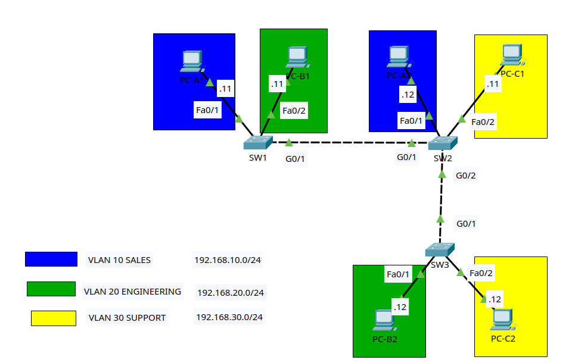

# Lab 1: VLANs and 802.1Q Trunking

## Goal

Build a small switched network in Packet Tracer and configure VLANs, access
ports, and 802.1Q trunks. When finished, hosts in the same VLAN will communicate
across switches. Hosts in different VLANs will not communicate because this lab
does not include a router or multilayer switch.

## Lab files

- Packet Tracer activity: [packet-tracer/01-vlans-and-trunking.pkt](packet-tracer/01-vlans-and-trunking.pkt)
- Topology image: [images/topology.png](images/topology.png)

## Topology



Use three Cisco 2960 switches and six PCs.

```text
 PC-A1          PC-B1                 PC-A2          PC-C1
VLAN 10        VLAN 20               VLAN 10        VLAN 30
   | Fa0/1       | Fa0/2                | Fa0/1        | Fa0/2
   +-------------- SW1 ===== trunk ===== SW2 -------------+
                         G0/1     G0/1    |
                                          | G0/2
                                          | trunk
                                          | G0/1
                                         SW3
                                  Fa0/1 /      \ Fa0/2
                                       /        \
                                    PC-B2      PC-C2
                                   VLAN 20    VLAN 30
```

### Cabling table

| Device | Port | Connects to | Port |
|---|---|---|---|
| PC-A1 | FastEthernet0 | SW1 | Fa0/1 |
| PC-B1 | FastEthernet0 | SW1 | Fa0/2 |
| SW1 | Gi0/1 | SW2 | Gi0/1 |
| PC-A2 | FastEthernet0 | SW2 | Fa0/1 |
| PC-C1 | FastEthernet0 | SW2 | Fa0/2 |
| SW2 | Gi0/2 | SW3 | Gi0/1 |
| PC-B2 | FastEthernet0 | SW3 | Fa0/1 |
| PC-C2 | FastEthernet0 | SW3 | Fa0/2 |

Packet Tracer's **Automatically Choose Connection Type** cable is fine. Wait
for the switch links to turn green before testing.

## Addressing and VLAN plan

The default gateway is intentionally blank; routing is not part of this lab.

| Host | VLAN | IP address | Mask | Connected port |
|---|---:|---|---|---|
| PC-A1 | 10 | 192.168.10.11 | 255.255.255.0 | SW1 Fa0/1 |
| PC-A2 | 10 | 192.168.10.12 | 255.255.255.0 | SW2 Fa0/1 |
| PC-B1 | 20 | 192.168.20.11 | 255.255.255.0 | SW1 Fa0/2 |
| PC-B2 | 20 | 192.168.20.12 | 255.255.255.0 | SW3 Fa0/1 |
| PC-C1 | 30 | 192.168.30.11 | 255.255.255.0 | SW2 Fa0/2 |
| PC-C2 | 30 | 192.168.30.12 | 255.255.255.0 | SW3 Fa0/2 |

| VLAN | Name | Purpose |
|---:|---|---|
| 10 | SALES | User VLAN |
| 20 | ENGINEERING | User VLAN |
| 30 | SUPPORT | User VLAN |
| 99 | MANAGEMENT | Switch management |
| 999 | NATIVE-BLACKHOLE | Unused native VLAN |

## Lab tasks

Try each task from the requirements first. The commands immediately below it
are a reference if you get stuck.

### Task 1 — Build and name the devices

1. Add the devices and cable them according to the topology.
2. Rename the switches `SW1`, `SW2`, and `SW3`.
3. Save the Packet Tracer project.

On each switch, using the appropriate hostname:

```ios
enable
configure terminal
hostname SW1
no ip domain-lookup
end
copy running-config startup-config
```

### Task 2 — Configure the PCs

On each PC, open **Desktop > IP Configuration** and enter its IP address and
subnet mask from the table. Leave **Default Gateway** and **DNS Server** blank.

At this stage, pings between PCs should fail because all ports are still in
VLAN 1 and PCs in matching VLAN groups use different IP subnets. Record this as
the baseline state.

### Task 3 — Create the VLANs on every switch

VLANs are locally significant: creating a VLAN on SW1 does not automatically
create it on SW2 or SW3. Configure all five VLANs on all three switches.

```ios
enable
configure terminal
vlan 10
 name SALES
vlan 20
 name ENGINEERING
vlan 30
 name SUPPORT
vlan 99
 name MANAGEMENT
vlan 999
 name NATIVE-BLACKHOLE
end
show vlan brief
```

Checkpoint: `show vlan brief` must list VLANs 10, 20, 30, 99, and 999.

### Task 4 — Configure the access ports

Configure only the PC-facing ports shown below.

**SW1**

```ios
configure terminal
interface fa0/1
 description PC-A1_SALES
 switchport mode access
 switchport access vlan 10
 spanning-tree portfast
interface fa0/2
 description PC-B1_ENGINEERING
 switchport mode access
 switchport access vlan 20
 spanning-tree portfast
end
```

**SW2**

```ios
configure terminal
interface fa0/1
 description PC-A2_SALES
 switchport mode access
 switchport access vlan 10
 spanning-tree portfast
interface fa0/2
 description PC-C1_SUPPORT
 switchport mode access
 switchport access vlan 30
 spanning-tree portfast
end
```

**SW3**

```ios
configure terminal
interface fa0/1
 description PC-B2_ENGINEERING
 switchport mode access
 switchport access vlan 20
 spanning-tree portfast
interface fa0/2
 description PC-C2_SUPPORT
 switchport mode access
 switchport access vlan 30
 spanning-tree portfast
end
```

Checkpoint on each switch:

```ios
show vlan brief
show interfaces status
```

The PC ports should appear under their assigned VLANs. Same-VLAN pings across
switches will still fail until the trunks are configured.

### Task 5 — Configure the trunks

Allow only the VLANs used by this lab. Use VLAN 999 as the native VLAN on both
ends of every trunk.

**SW1**

```ios
configure terminal
interface gi0/1
 description TRUNK_TO_SW2
 switchport mode trunk
 switchport trunk native vlan 999
 switchport trunk allowed vlan 10,20,30,99,999
end
```

**SW2**

```ios
configure terminal
interface gi0/1
 description TRUNK_TO_SW1
 switchport mode trunk
 switchport trunk native vlan 999
 switchport trunk allowed vlan 10,20,30,99,999
interface gi0/2
 description TRUNK_TO_SW3
 switchport mode trunk
 switchport trunk native vlan 999
 switchport trunk allowed vlan 10,20,30,99,999
end
```

**SW3**

```ios
configure terminal
interface gi0/1
 description TRUNK_TO_SW2
 switchport mode trunk
 switchport trunk native vlan 999
 switchport trunk allowed vlan 10,20,30,99,999
end
```

Checkpoint:

```ios
show interfaces trunk
```

Confirm that the expected interfaces are trunking, native VLAN 999 is shown,
and VLANs `10,20,30,99,999` are allowed and forwarding.

> Some switch models accept `switchport trunk encapsulation dot1q`. A 2960 uses
> 802.1Q only, so that command is not available or required.

### Task 6 — Verify end-to-end connectivity

Open **Desktop > Command Prompt** on each PC and test:

```text
PC-A1> ping 192.168.10.12    should succeed (VLAN 10)
PC-B1> ping 192.168.20.12    should succeed (VLAN 20)
PC-C1> ping 192.168.30.12    should succeed (VLAN 30)
PC-A1> ping 192.168.20.11    should fail (different VLAN)
PC-A2> ping 192.168.30.11    should fail (different VLAN)
```

The first ping can lose one packet while ARP resolves. Repeat it before deciding
there is a fault. Different-VLAN pings should fail even though the IP networks
are valid: a Layer 3 device is needed to route between VLANs.

On the switches, inspect what they learned:

```ios
show mac address-table dynamic
show interfaces trunk
show interfaces fa0/1 switchport
```

### Task 7 — Configure switch management addresses

Give each switch an SVI in VLAN 99. These addresses let the switches ping one
another over the trunks; they do not provide inter-VLAN routing.

| Switch | VLAN 99 address |
|---|---|
| SW1 | 192.168.99.11/24 |
| SW2 | 192.168.99.12/24 |
| SW3 | 192.168.99.13/24 |

Example for SW1 (change the final octet on SW2 and SW3):

```ios
configure terminal
interface vlan 99
 description MANAGEMENT_SVI
 ip address 192.168.99.11 255.255.255.0
 no shutdown
end
show ip interface brief
ping 192.168.99.12
ping 192.168.99.13
```

The VLAN 99 interface should be `up/up` once VLAN 99 exists and an active trunk
is carrying it.

### Task 8 — Secure unused access ports

Place unused FastEthernet ports in the black-hole VLAN and shut them down. Do
not include active PC ports or Gigabit trunk ports in the range.

Run on every switch:

```ios
configure terminal
interface range fa0/3-24
 description UNUSED_DISABLED
 switchport mode access
 switchport access vlan 999
 shutdown
end
copy running-config startup-config
```

Final checks:

```ios
show vlan brief
show interfaces trunk
show ip interface brief
show interfaces status
show mac address-table dynamic
show running-config
```

## Troubleshooting challenges

After the working configuration is saved, introduce one fault at a time. Find
the problem using show commands before correcting it.

1. Remove VLAN 20 from the allowed-VLAN list on the SW2-to-SW3 trunk. Determine
   which ping fails and why.
2. Change the native VLAN to 99 on only SW3 Gi0/1. Find the mismatch warning and
   restore VLAN 999.
3. Put SW2 Fa0/1 in VLAN 30. Use `show vlan brief` and
   `show interfaces fa0/1 switchport` to identify the wrong access VLAN.
4. Delete VLAN 30 from SW3. Observe the state of Fa0/2 and the VLAN list, then
   recreate VLAN 30.

## Completion checklist

- All VLANs exist with the correct names on all switches.
- PC-facing ports are static access ports in the correct VLANs.
- Inter-switch links are trunks with native VLAN 999.
- Only VLANs 10, 20, 30, 99, and 999 are allowed on the trunks.
- Same-VLAN hosts can ping across switches.
- Different-VLAN hosts cannot ping in this Layer 2-only lab.
- All three management SVIs can ping one another.
- Unused FastEthernet ports are assigned to VLAN 999 and shut down.
- Running configurations are saved.
