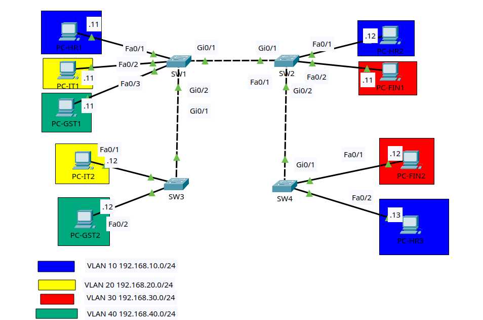

# Practice Lab 2: VLANs and Trunking

Status: complete.

## Goal

Build a new Layer 2 network from scratch and practice VLAN creation, access
ports, trunk links, allowed VLAN lists, native VLANs, and management SVIs.

This is still a Layer 2-only lab. Hosts in the same VLAN should communicate
across switches. Hosts in different VLANs should not communicate because there
is no router or multilayer switch in this practice lab.

## Lab files

- Packet Tracer activity: [packet-tracer/02-vlans-and-trunking.pkt](packet-tracer/02-vlans-and-trunking.pkt)
- Topology image: [images/topology.png](images/topology.png)

## Topology



Use four Cisco 2960 switches and nine PCs.

```text
                       Gi0/1 trunk Gi0/1
                 +---------+     +---------+
 PC-HR1  Fa0/1 --|         |-----|         |-- Fa0/1  PC-HR2
 PC-IT1  Fa0/2 --|   SW1   |     |   SW2   |-- Fa0/2  PC-FIN1
 PC-GST1 Fa0/3 --|         |     |         |
                 +---------+     +---------+
                     |               |
                     | Gi0/2         | Gi0/2
                     | trunk         | trunk
                     | Gi0/1         | Gi0/1
                 +---------+     +---------+
 PC-IT2  Fa0/1 --|         |     |         |-- Fa0/1  PC-FIN2
 PC-GST2 Fa0/2 --|   SW3   |     |   SW4   |-- Fa0/2  PC-HR3
                 |         |     |         |
                 +---------+     +---------+
```

Trunk links:

- SW1 Gi0/1 to SW2 Gi0/1
- SW1 Gi0/2 to SW3 Gi0/1
- SW2 Gi0/2 to SW4 Gi0/1

### Cabling table

| Device | Port | Connects to | Port |
|---|---|---|---|
| PC-HR1 | FastEthernet0 | SW1 | Fa0/1 |
| PC-IT1 | FastEthernet0 | SW1 | Fa0/2 |
| PC-GST1 | FastEthernet0 | SW1 | Fa0/3 |
| PC-HR2 | FastEthernet0 | SW2 | Fa0/1 |
| PC-FIN1 | FastEthernet0 | SW2 | Fa0/2 |
| PC-IT2 | FastEthernet0 | SW3 | Fa0/1 |
| PC-GST2 | FastEthernet0 | SW3 | Fa0/2 |
| PC-FIN2 | FastEthernet0 | SW4 | Fa0/1 |
| PC-HR3 | FastEthernet0 | SW4 | Fa0/2 |
| SW1 | Gi0/1 | SW2 | Gi0/1 |
| SW1 | Gi0/2 | SW3 | Gi0/1 |
| SW2 | Gi0/2 | SW4 | Gi0/1 |

Packet Tracer's **Automatically Choose Connection Type** cable is fine.

## Addressing and VLAN plan

Leave the default gateway blank on every PC.

| Host | VLAN | IP address | Mask | Connected port |
|---|---:|---|---|---|
| PC-HR1 | 10 | 192.168.10.11 | 255.255.255.0 | SW1 Fa0/1 |
| PC-HR2 | 10 | 192.168.10.12 | 255.255.255.0 | SW2 Fa0/1 |
| PC-HR3 | 10 | 192.168.10.13 | 255.255.255.0 | SW4 Fa0/2 |
| PC-IT1 | 20 | 192.168.20.11 | 255.255.255.0 | SW1 Fa0/2 |
| PC-IT2 | 20 | 192.168.20.12 | 255.255.255.0 | SW3 Fa0/1 |
| PC-FIN1 | 30 | 192.168.30.11 | 255.255.255.0 | SW2 Fa0/2 |
| PC-FIN2 | 30 | 192.168.30.12 | 255.255.255.0 | SW4 Fa0/1 |
| PC-GST1 | 40 | 192.168.40.11 | 255.255.255.0 | SW1 Fa0/3 |
| PC-GST2 | 40 | 192.168.40.12 | 255.255.255.0 | SW3 Fa0/2 |

| VLAN | Name | Purpose |
|---:|---|---|
| 10 | HR | User VLAN |
| 20 | IT | User VLAN |
| 30 | FINANCE | User VLAN |
| 40 | GUEST | User VLAN |
| 99 | MANAGEMENT | Switch management |
| 999 | NATIVE-BLACKHOLE | Unused native VLAN |

## Lab tasks

Try each task from the requirements first. Use the command examples only when
you need a nudge.

### Task 1 - Build and name the devices

1. Add four Cisco 2960 switches.
2. Add nine PCs.
3. Cable everything according to the cabling table.
4. Rename the switches `SW1`, `SW2`, `SW3`, and `SW4`.
5. Save the Packet Tracer file as `02-vlans-and-trunking.pkt`.

On each switch, using the correct hostname:

```ios
enable
configure terminal
hostname SW1
no ip domain-lookup
end
copy running-config startup-config
```

### Task 2 - Configure the PCs

On each PC, open **Desktop > IP Configuration** and enter the IP address and
subnet mask from the addressing table.

Leave these fields blank:

- Default Gateway
- DNS Server

### Task 3 - Create VLANs on every switch

Create all VLANs on SW1, SW2, SW3, and SW4.

```ios
configure terminal
vlan 10
 name HR
vlan 20
 name IT
vlan 30
 name FINANCE
vlan 40
 name GUEST
vlan 99
 name MANAGEMENT
vlan 999
 name NATIVE-BLACKHOLE
end
show vlan brief
```

Checkpoint: every switch should list VLANs 10, 20, 30, 40, 99, and 999.

### Task 4 - Configure access ports

Configure the PC-facing ports only.

**SW1**

```ios
configure terminal
interface fa0/1
 description PC-HR1
 switchport mode access
 switchport access vlan 10
 spanning-tree portfast
interface fa0/2
 description PC-IT1
 switchport mode access
 switchport access vlan 20
 spanning-tree portfast
interface fa0/3
 description PC-GST1
 switchport mode access
 switchport access vlan 40
 spanning-tree portfast
end
```

**SW2**

```ios
configure terminal
interface fa0/1
 description PC-HR2
 switchport mode access
 switchport access vlan 10
 spanning-tree portfast
interface fa0/2
 description PC-FIN1
 switchport mode access
 switchport access vlan 30
 spanning-tree portfast
end
```

**SW3**

```ios
configure terminal
interface fa0/1
 description PC-IT2
 switchport mode access
 switchport access vlan 20
 spanning-tree portfast
interface fa0/2
 description PC-GST2
 switchport mode access
 switchport access vlan 40
 spanning-tree portfast
end
```

**SW4**

```ios
configure terminal
interface fa0/1
 description PC-FIN2
 switchport mode access
 switchport access vlan 30
 spanning-tree portfast
interface fa0/2
 description PC-HR3
 switchport mode access
 switchport access vlan 10
 spanning-tree portfast
end
```

Checkpoint:

```ios
show vlan brief
show interfaces status
```

Each PC-facing port should appear in the correct VLAN.

### Task 5 - Configure trunks

Configure the switch-to-switch links as trunks. Use VLAN 999 as the native
VLAN. Allow only the user and management VLANs; exclude the unused black-hole
VLAN 999 from the allowed lists.

**SW1**

```ios
configure terminal
interface gi0/1
 description TRUNK_TO_SW2
 switchport mode trunk
 switchport trunk native vlan 999
 switchport trunk allowed vlan 10,20,30,40,99
interface gi0/2
 description TRUNK_TO_SW3
 switchport mode trunk
 switchport trunk native vlan 999
 switchport trunk allowed vlan 10,20,30,40,99
end
```

**SW2**

```ios
configure terminal
interface gi0/1
 description TRUNK_TO_SW1
 switchport mode trunk
 switchport trunk native vlan 999
 switchport trunk allowed vlan 10,20,30,40,99
interface gi0/2
 description TRUNK_TO_SW4
 switchport mode trunk
 switchport trunk native vlan 999
 switchport trunk allowed vlan 10,20,30,40,99
end
```

**SW3**

```ios
configure terminal
interface gi0/1
 description TRUNK_TO_SW1
 switchport mode trunk
 switchport trunk native vlan 999
 switchport trunk allowed vlan 10,20,30,40,99
end
```

**SW4**

```ios
configure terminal
interface gi0/1
 description TRUNK_TO_SW2
 switchport mode trunk
 switchport trunk native vlan 999
 switchport trunk allowed vlan 10,20,30,40,99
end
```

Checkpoint:

```ios
show interfaces trunk
```

Each trunk should show native VLAN 999 and allowed VLANs `10,20,30,40,99`.
VLAN 999 should not appear in the allowed-and-active or forwarding lists.

### Task 6 - Verify same-VLAN connectivity

Test these pings from the PCs:

```text
PC-HR1> ping 192.168.10.12
PC-HR1> ping 192.168.10.13
PC-IT1> ping 192.168.20.12
PC-FIN1> ping 192.168.30.12
PC-GST1> ping 192.168.40.12
```

The pings should succeed. If the first ping drops one packet, repeat it.

### Task 7 - Verify VLAN separation

Test these pings:

```text
PC-HR1> ping 192.168.20.11
PC-IT1> ping 192.168.30.11
PC-FIN1> ping 192.168.40.11
```

These should fail because there is no Layer 3 device routing between VLANs.

### Task 8 - Configure management SVIs

Configure VLAN 99 management IPs on the switches.

| Switch | VLAN 99 address |
|---|---|
| SW1 | 192.168.99.11/24 |
| SW2 | 192.168.99.12/24 |
| SW3 | 192.168.99.13/24 |
| SW4 | 192.168.99.14/24 |

Example for SW1:

```ios
configure terminal
interface vlan 99
 description MANAGEMENT_SVI
 ip address 192.168.99.11 255.255.255.0
 no shutdown
end
show ip interface brief
```

Change the final octet on SW2, SW3, and SW4.

Test from SW1:

```ios
ping 192.168.99.12
ping 192.168.99.13
ping 192.168.99.14
```

The pings should succeed because VLAN 99 is carried across the trunks.

### Task 9 - Secure unused ports

Place unused FastEthernet ports in VLAN 999 and shut them down.

Run on every switch, but do not include active PC ports:

```ios
configure terminal
interface range fa0/4-24
 description UNUSED_DISABLED
 switchport mode access
 switchport access vlan 999
 shutdown
end
```

On SW2, SW3, and SW4, adjust the range if needed so you do not shut down any
active PC-facing ports.

### Task 10 - Save and verify

Run on every switch:

```ios
copy running-config startup-config
```

Final verification commands:

```ios
show vlan brief
show interfaces trunk
show ip interface brief
show interfaces status
show mac address-table dynamic
show running-config
```

## Troubleshooting challenges

After the lab works, introduce one fault at a time. Find the problem using show
commands before correcting it.

1. On SW1 Gi0/2, remove VLAN 40 from the allowed VLAN list. Which ping fails?
2. On SW4 Fa0/2, change the access VLAN from 10 to 30. Which host is isolated?
3. On SW2 Gi0/2, change the native VLAN to 99. What warning or mismatch do you see?
4. Delete VLAN 30 from SW4. What happens to PC-FIN2's port?
5. Shut down SW1 Gi0/1. Which VLANs lose connectivity, and why?

## Completion checklist

- All switches have VLANs 10, 20, 30, 40, 99, and 999.
- All PC ports are static access ports in the correct VLAN.
- All switch-to-switch links are trunks.
- Native VLAN is 999 on every trunk.
- Allowed VLAN lists match on both ends of every trunk.
- Only VLANs 10, 20, 30, 40, and 99 are allowed on the trunks.
- VLAN 999 is excluded from the allowed lists.
- Same-VLAN PCs can ping across switches.
- Different-VLAN PCs cannot ping.
- Management SVIs can ping across VLAN 99.
- Unused ports are placed in VLAN 999 and shut down.
- Running configurations are saved.
