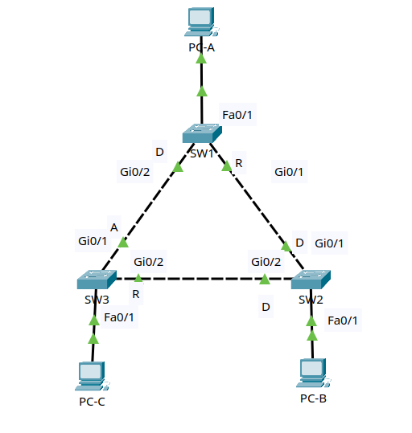

# Lab 1: Spanning Tree Protocol Basics

## Goal

Build a redundant Layer 2 switching topology and use Spanning Tree Protocol
to prevent loops. When finished, you will be able to identify the root bridge,
root ports, designated ports, and blocked ports. You will also manually control
which switch becomes the root bridge for each VLAN.

This lab does not include routing. The focus is STP behavior on redundant
switch links.

## Lab files

- Packet Tracer activity: save your file as `packet-tracer/lab-01-spanning-tree-basics.pkt`
- Topology image: optional, save as `images/topology.png`

## Topology



Use three Cisco 2960 switches and three PCs.

```text
                       PC-A
                       VLAN10
                         |
                       Fa0/1
                         |
                        SW1
                    Gi0/2 / \ Gi0/1
                         /   \
                    Gi0/1     Gi0/1
                      SW3-----SW2
                    Gi0/2     Gi0/2
                      |       |
                    Fa0/1   Fa0/1
                      |       |
                     PC-C    PC-B
                    VLAN10  VLAN10
```

Trunk links:

- SW1 Gi0/1 to SW2 Gi0/1
- SW1 Gi0/2 to SW3 Gi0/1
- SW2 Gi0/2 to SW3 Gi0/2

Each switch has one PC in VLAN 10.

### Cabling table

| Device | Port | Connects to | Port |
|---|---|---|---|
| PC-A | FastEthernet0 | SW1 | Fa0/1 |
| PC-B | FastEthernet0 | SW2 | Fa0/1 |
| PC-C | FastEthernet0 | SW3 | Fa0/1 |
| SW1 | Gi0/1 | SW2 | Gi0/1 |
| SW2 | Gi0/2 | SW3 | Gi0/2 |
| SW3 | Gi0/1 | SW1 | Gi0/2 |

Packet Tracer's **Automatically Choose Connection Type** cable is fine. Wait
for the links to turn green or amber before testing.

## Addressing and VLAN plan

| Host | VLAN | IP address | Mask | Default gateway |
|---|---:|---|---|---|
| PC-A | 10 | 192.168.10.11 | 255.255.255.0 | blank |
| PC-B | 10 | 192.168.10.12 | 255.255.255.0 | blank |
| PC-C | 10 | 192.168.10.13 | 255.255.255.0 | blank |

| VLAN | Name | Purpose |
|---:|---|---|
| 10 | USERS | User VLAN |
| 99 | MANAGEMENT | Switch management |
| 999 | NATIVE-BLACKHOLE | Unused native VLAN |

## Lab tasks

Try each task from the requirements first. The commands immediately below it
are a reference if you get stuck.

### Task 1 - Build and name the devices

1. Add three Cisco 2960 switches.
2. Add three PCs.
3. Cable the devices according to the topology.
4. Rename the switches `SW1`, `SW2`, and `SW3`.
5. Save the Packet Tracer project as `lab-01-spanning-tree-basics.pkt`.

On each switch, using the correct hostname:

```ios
enable
configure terminal
hostname SW1
no ip domain-lookup
end
copy running-config startup-config
```

### Task 2 - Configure the PCs

On each PC, open **Desktop > IP Configuration** and enter the IP address and
subnet mask from the table. Leave the default gateway blank.

At this point, pings may not work consistently because the switch ports and
trunks are not fully configured yet.

### Task 3 - Create VLANs on every switch

Configure the same VLANs on all three switches.

```ios
enable
configure terminal
vlan 10
 name USERS
vlan 99
 name MANAGEMENT
vlan 999
 name NATIVE-BLACKHOLE
end
show vlan brief
```

Checkpoint: `show vlan brief` should list VLANs 10, 99, and 999.

### Task 4 - Configure access ports

Configure each PC-facing port as an access port in VLAN 10.

Run on SW1, SW2, and SW3:

```ios
configure terminal
interface fa0/1
 description PC_USER
 switchport mode access
 switchport access vlan 10
 spanning-tree portfast
 spanning-tree bpduguard enable
end
```

Checkpoint:

```ios
show vlan brief
show interfaces fa0/1 switchport
```

The PC port should be an access port in VLAN 10.

### Task 5 - Configure trunk links

Configure all switch-to-switch links as trunks. Use VLAN 999 as the native VLAN.

**SW1**

```ios
configure terminal
interface gi0/1
 description TRUNK_TO_SW2
 switchport mode trunk
 switchport trunk native vlan 999
 switchport trunk allowed vlan 10,99,999
interface gi0/2
 description TRUNK_TO_SW3
 switchport mode trunk
 switchport trunk native vlan 999
 switchport trunk allowed vlan 10,99,999
end
```

**SW2**

```ios
configure terminal
interface gi0/1
 description TRUNK_TO_SW1
 switchport mode trunk
 switchport trunk native vlan 999
 switchport trunk allowed vlan 10,99,999
interface gi0/2
 description TRUNK_TO_SW3
 switchport mode trunk
 switchport trunk native vlan 999
 switchport trunk allowed vlan 10,99,999
end
```

**SW3**

```ios
configure terminal
interface gi0/1
 description TRUNK_TO_SW1
 switchport mode trunk
 switchport trunk native vlan 999
 switchport trunk allowed vlan 10,99,999
interface gi0/2
 description TRUNK_TO_SW2
 switchport mode trunk
 switchport trunk native vlan 999
 switchport trunk allowed vlan 10,99,999
end
```

Checkpoint:

```ios
show interfaces trunk
```

All Gigabit links should be trunking. Because the switches form a triangle,
STP should block one path to stop a Layer 2 loop.

### Task 6 - Observe default STP behavior

On each switch, run:

```ios
show spanning-tree vlan 10
```

Record these details:

| Question | Answer |
|---|---|
| Which switch is the root bridge for VLAN 10? | |
| Which ports are root ports? | |
| Which ports are designated ports? | |
| Which port is blocking? | |

Useful STP states:

| State | Meaning |
|---|---|
| FWD | Forwarding traffic |
| BLK | Blocking to prevent a loop |
| LIS | Listening during convergence |
| LRN | Learning MAC addresses during convergence |

In a triangle of switches, one trunk port should be blocking for VLAN 10.
That is correct. STP is protecting the network from a loop.

### Task 7 - Make SW1 the root bridge

Right now, the root bridge is probably whichever switch has the lowest bridge
ID. That can feel random because Packet Tracer switch MAC addresses decide the
tie-breaker.

Make SW1 the root bridge for VLAN 10.

On SW1:

```ios
configure terminal
spanning-tree vlan 10 root primary
end
show spanning-tree vlan 10
```

On SW2:

```ios
configure terminal
spanning-tree vlan 10 root secondary
end
```

Checkpoint on all switches:

```ios
show spanning-tree vlan 10
```

Confirm that SW1 says:

```text
This bridge is the root
```

### Task 8 - Verify connectivity

From the PCs, test same-VLAN connectivity:

```text
PC-A> ping 192.168.10.12
PC-A> ping 192.168.10.13
PC-B> ping 192.168.10.13
```

The pings should succeed. If the first ping loses a packet, repeat it. ARP may
need a moment.

Then check the MAC table:

```ios
show mac address-table dynamic vlan 10
```

You should see PC MAC addresses learned on access ports and trunks.

### Task 9 - Change the STP path with port cost

In this task, you will influence which redundant link STP prefers.

On SW3, increase the STP cost toward SW1:

```ios
configure terminal
interface gi0/1
 spanning-tree vlan 10 cost 50
end
show spanning-tree vlan 10
```

Wait a few seconds, then check all switches:

```ios
show spanning-tree vlan 10
```

Observe whether the blocked port moved. The exact blocked port depends on the
current root bridge and path costs, but the important idea is this: lower STP
cost is preferred, higher STP cost is less preferred.

Restore the default cost:

```ios
configure terminal
interface gi0/1
 no spanning-tree vlan 10 cost
end
```

### Task 10 - Test STP reconvergence

Shut down the trunk from the root bridge to SW2 and watch STP recover. Since
SW1 is the root bridge in this lab, use SW1 Gi0/1.

Before shutting it down, check the current STP state:

```ios
show spanning-tree vlan 10
```

On SW2, the direct path to SW1 should be the root port. When SW1 Gi0/1 goes
down, SW2 should use the SW2-to-SW3 trunk as its new path back to the root.

On SW1:

```ios
configure terminal
interface gi0/1
 shutdown
end
```

Wait for STP to reconverge, then test:

```text
PC-A> ping 192.168.10.12
PC-A> ping 192.168.10.13
```

Check STP:

```ios
show spanning-tree vlan 10
```

Bring the link back:

```ios
configure terminal
interface gi0/1
 no shutdown
end
```

Wait for the link to return before continuing.

### Task 11 - Configure management SVIs

Give each switch a management IP address in VLAN 99.

| Switch | VLAN 99 address |
|---|---|
| SW1 | 192.168.99.11/24 |
| SW2 | 192.168.99.12/24 |
| SW3 | 192.168.99.13/24 |

Example for SW1:

```ios
configure terminal
interface vlan 99
 description MANAGEMENT_SVI
 ip address 192.168.99.11 255.255.255.0
 no shutdown
end
show ip interface brief
```

Change the final octet on SW2 and SW3.

Test from SW1:

```ios
ping 192.168.99.12
ping 192.168.99.13
```

The switches should be able to ping each other over VLAN 99.

### Task 12 - Save the configurations

Run on every switch:

```ios
copy running-config startup-config
```

Final verification commands:

```ios
show spanning-tree vlan 10
show interfaces trunk
show vlan brief
show ip interface brief
show mac address-table dynamic
show running-config
```

## Troubleshooting challenges

After the working configuration is saved, introduce one fault at a time. Find
the problem using show commands before correcting it.

1. Remove VLAN 10 from one trunk allowed list. Identify which PCs can no longer
   ping and restore the allowed VLAN.
2. Change the native VLAN to 99 on only one side of a trunk. Use
   `show interfaces trunk` and switch messages to find the mismatch.
3. Remove `spanning-tree vlan 10 root primary` from SW1 and observe which switch
   becomes root.
4. Enable PortFast on a trunk and check why that is unsafe. Remove it afterward.
5. Shut down the current root port on a non-root switch. Watch which port becomes
   the new root port.

## Completion checklist

- VLANs 10, 99, and 999 exist on all switches.
- PC-facing ports are access ports in VLAN 10.
- PC-facing ports use PortFast and BPDU Guard.
- Switch-to-switch links are trunks.
- Trunks use native VLAN 999.
- Trunks allow only VLANs 10, 99, and 999.
- SW1 is the root bridge for VLAN 10.
- SW2 is configured as the secondary root bridge for VLAN 10.
- One redundant trunk path is blocking for VLAN 10.
- All PCs in VLAN 10 can ping one another.
- All switch management SVIs can ping one another.
- Running configurations are saved.
