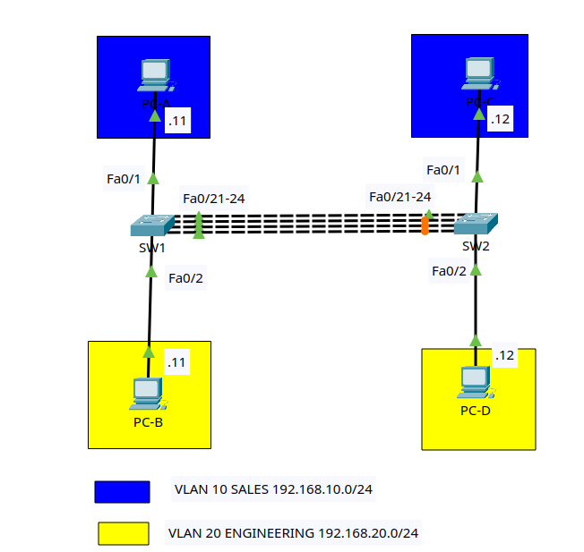

# Lab 1: LACP EtherChannel Basics

## Goal

Build an EtherChannel between two switches using Link Aggregation Control
Protocol (LACP). The channel will carry two VLANs as an 802.1Q trunk. You will
verify the bundle, observe how STP treats it, and prove that traffic continues
when a member link fails.

This lab uses LACP because it is the open-standard negotiation protocol and is
the best default choice when both devices support it.

## Lab files

- Packet Tracer activity: save as
  `packet-tracer/lab-01-lacp-etherchannel.pkt`
- Topology image: [images/topology.png](images/topology.png)

## Topology



Use two Cisco 2960 switches and four PCs.

```text
 PC-A (VLAN 10)                         PC-C (VLAN 10)
       |                                      |
     Fa0/1                                  Fa0/1
       |    Fa0/21-24          Fa0/21-24      |
      SW1 ============== Po1 ============== SW2
       |                                      |
     Fa0/2                                  Fa0/2
       |                                      |
 PC-B (VLAN 20)                         PC-D (VLAN 20)
```

`Po1` is one logical link made from four physical links.

### Cabling table

| Device | Port | Connects to | Port |
|---|---|---|---|
| PC-A | FastEthernet0 | SW1 | Fa0/1 |
| PC-B | FastEthernet0 | SW1 | Fa0/2 |
| PC-C | FastEthernet0 | SW2 | Fa0/1 |
| PC-D | FastEthernet0 | SW2 | Fa0/2 |
| SW1 | Fa0/21 | SW2 | Fa0/21 |
| SW1 | Fa0/22 | SW2 | Fa0/22 |
| SW1 | Fa0/23 | SW2 | Fa0/23 |
| SW1 | Fa0/24 | SW2 | Fa0/24 |

Packet Tracer's **Automatically Choose Connection Type** cable is fine. Wait
for the links to initialize before testing.

## Addressing and VLAN plan

| Host | VLAN | IP address | Mask | Default gateway |
|---|---:|---|---|---|
| PC-A | 10 | 192.168.10.11 | 255.255.255.0 | blank |
| PC-C | 10 | 192.168.10.12 | 255.255.255.0 | blank |
| PC-B | 20 | 192.168.20.11 | 255.255.255.0 | blank |
| PC-D | 20 | 192.168.20.12 | 255.255.255.0 | blank |

| VLAN | Name | Purpose |
|---:|---|---|
| 10 | SALES | Sales hosts |
| 20 | ENGINEERING | Engineering hosts |
| 999 | NATIVE-BLACKHOLE | Unused native VLAN |

There is no router in this lab. Hosts in the same VLAN can communicate, but
VLAN 10 cannot communicate with VLAN 20.

## Lab tasks

Try each task from the requirements first. Use the commands below as a
reference if you get stuck.

### Task 1 - Build and name the devices

1. Add two Cisco 2960 switches and four PCs.
2. Cable the devices according to the cabling table.
3. Rename the switches `SW1` and `SW2`.
4. Save the project as `lab-01-lacp-etherchannel.pkt`.

On each switch, using the correct hostname:

```ios
enable
configure terminal
hostname SW1
no ip domain-lookup
end
copy running-config startup-config
```

### Task 2 - Configure the PCs

On each PC, open **Desktop > IP Configuration** and enter the address and mask
from the table. Leave the default gateway blank.

### Task 3 - Create the VLANs

Run on both switches:

```ios
configure terminal
vlan 10
 name SALES
vlan 20
 name ENGINEERING
vlan 999
 name NATIVE-BLACKHOLE
end
show vlan brief
```

Checkpoint: VLANs 10, 20, and 999 should appear on both switches.

### Task 4 - Configure the access ports

On SW1:

```ios
configure terminal
interface fa0/1
 description PC-A_SALES
 switchport mode access
 switchport access vlan 10
 spanning-tree portfast
 spanning-tree bpduguard enable
interface fa0/2
 description PC-B_ENGINEERING
 switchport mode access
 switchport access vlan 20
 spanning-tree portfast
 spanning-tree bpduguard enable
end
```

On SW2:

```ios
configure terminal
interface fa0/1
 description PC-C_SALES
 switchport mode access
 switchport access vlan 10
 spanning-tree portfast
 spanning-tree bpduguard enable
interface fa0/2
 description PC-D_ENGINEERING
 switchport mode access
 switchport access vlan 20
 spanning-tree portfast
 spanning-tree bpduguard enable
end
```

### Task 5 - Bundle the physical interfaces with LACP

Shut down the four links before bundling them. This prevents the parallel
interfaces from forwarding as separate links while the EtherChannel is being
built.

Run on both switches:

```ios
configure terminal
interface range fa0/21 - 24
 description LACP_MEMBER_TO_OTHER_SWITCH
 shutdown
 channel-group 1 mode active
end
```

All members must use compatible settings such as speed, duplex, Layer 2 mode,
and channel protocol. Do not configure IP addresses or trunk VLAN settings on
the individual members.

Checkpoint:

```ios
show etherchannel summary
```

Port-channel 1 should exist and use LACP. It remains down until its physical
members are enabled in Task 6.

### Task 6 - Configure Port-Channel 1 as a trunk

Apply the trunk configuration to the logical port-channel. IOS uses this
configuration for the bundled member links. Allow only the user VLANs; keep
VLAN 999 as the native VLAN but exclude it from the allowed list.

Run on both switches:

```ios
configure terminal
interface port-channel 1
 description LACP_TRUNK_TO_OTHER_SWITCH
 switchport mode trunk
 switchport trunk native vlan 999
 switchport trunk allowed vlan 10,20
 no shutdown
exit
interface range fa0/21 - 24
 no shutdown
end
```

Wait several seconds for LACP to negotiate.

Checkpoint:

```ios
show etherchannel summary
show interfaces trunk
```

Expected flags include:

```text
Group  Port-channel  Protocol  Ports
1      Po1(SU)       LACP      Fa0/21(P) Fa0/22(P) Fa0/23(P) Fa0/24(P)
```

- `S` means Layer 2.
- `U` means the port-channel is in use.
- `P` means the interface is bundled in the port-channel.

### Task 7 - Verify EtherChannel details

Run on both switches:

```ios
show etherchannel port-channel
show interfaces port-channel 1
show interfaces fa0/21 etherchannel
```

Confirm that all four ports belong to channel group 1 and use LACP.

Also check STP:

```ios
show spanning-tree vlan 10
show spanning-tree vlan 20
```

STP should list `Po1`, not four independent parallel links. EtherChannel avoids
having STP block individual member links because the bundle is one logical
port.

### Task 8 - Test connectivity

Test the matching VLANs:

```text
PC-A> ping 192.168.10.12
PC-B> ping 192.168.20.12
```

Both pings should succeed. The first ping may lose a packet while ARP resolves.

Now prove that this lab has no inter-VLAN routing:

```text
PC-A> ping 192.168.20.12
```

This ping should fail. PC-A and PC-D are in different IP networks and have no
default gateway.

### Task 9 - Test member-link resilience

Start a repeated ping from PC-A to PC-C:

```text
PC-A> ping -t 192.168.10.12
```

On SW1, shut down one channel member:

```ios
configure terminal
interface fa0/21
 shutdown
end
show etherchannel summary
```

The ping should continue over the remaining member links. In the summary,
Fa0/21 should no longer show as bundled while `Po1` remains up.

Restore the link:

```ios
configure terminal
interface fa0/21
 no shutdown
end
```

Wait for the port to rejoin, then confirm it has a `(P)` flag.

### Task 10 - Observe load-balancing information

Run:

```ios
show etherchannel load-balance
```

EtherChannel selects a member link using a hash. One conversation normally
stays on one physical link, which prevents frames from arriving out of order.
Adding links increases aggregate capacity across multiple conversations; it
does not turn one FastEthernet flow into a 400 Mb/s flow.

### Task 11 - Save and perform final verification

Run on both switches:

```ios
copy running-config startup-config
show etherchannel summary
show interfaces trunk
show vlan brief
show spanning-tree vlan 10
show spanning-tree vlan 20
show interfaces status
```

## LACP mode reference

| Local mode | Remote mode | Forms? |
|---|---|---|
| active | active | Yes |
| active | passive | Yes |
| passive | passive | No |

`active` sends LACP messages. `passive` listens and responds. At least one end
must be active.

## Troubleshooting challenges

Introduce one fault at a time after saving the working configuration. Diagnose
it with show commands before fixing it.

1. Remove SW2 Fa0/24 from channel group 1. Find the unbundled interface with
   `show etherchannel summary`, then restore its LACP membership.
2. Remove VLAN 20 from the allowed list on Po1 at one switch. Determine why the
   VLAN 10 ping works while the VLAN 20 ping fails.
3. Change SW2's member interfaces to LACP passive, leaving SW1 active. Confirm
   that the channel still forms.
4. Change both ends to passive. Explain why the channel does not form, then
   restore active mode.
5. Shut down three member links. Confirm that Po1 stays operational on the last
   member, then restore every link.

## Completion checklist

- VLANs 10, 20, and 999 exist on both switches.
- PC-facing ports are in the correct access VLANs.
- Fa0/21 through Fa0/24 belong to channel group 1 and use compatible settings.
- Port-channel 1 uses LACP.
- `Po1` shows `(SU)` and every active member shows `(P)`.
- The trunk allows only VLANs 10 and 20.
- VLAN 999 is the native VLAN on both ends.
- VLAN 999 is excluded from the allowed lists.
- Same-VLAN pings succeed across the EtherChannel.
- Different-VLAN pings fail because no router is present.
- Connectivity survives the loss of one member link.
- The running configurations are saved.
