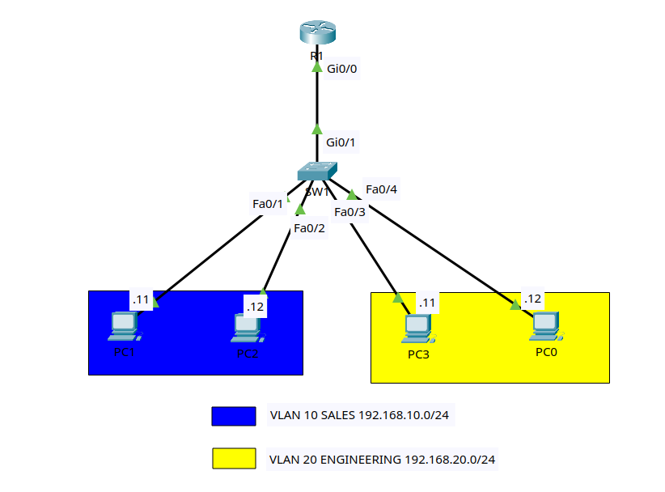

# Lab 1: Router-on-a-Stick

## Goal

Configure inter-VLAN routing with one router interface, an 802.1Q trunk, and
one router subinterface per routed VLAN. When finished, hosts in VLANs 10 and
20 will use different default gateways and communicate through the router.

This design is called router-on-a-stick because one physical router interface
carries traffic for multiple VLANs.

## Lab files

- Packet Tracer activity: save as
  `packet-tracer/lab-01-router-on-a-stick.pkt`
- Topology image: [images/topology.png](images/topology.png)

## Topology



Use one Cisco 2911 router, one Cisco 2960 switch, and four PCs.

```text
                              R1
                            Gi0/0
                               |
                         802.1Q trunk
                               |
                            Gi0/1
                              SW1
                               |
            +------------+-----+-----+------------+
            |            |           |            |
          Fa0/1        Fa0/2       Fa0/3        Fa0/4
            |            |           |            |
           PC-A         PC-B        PC-C         PC-D
         VLAN 10      VLAN 10     VLAN 20      VLAN 20
```

### Cabling table

| Device | Port | Connects to | Port |
|---|---|---|---|
| R1 | Gi0/0 | SW1 | Gi0/1 |
| PC-A | FastEthernet0 | SW1 | Fa0/1 |
| PC-B | FastEthernet0 | SW1 | Fa0/2 |
| PC-C | FastEthernet0 | SW1 | Fa0/3 |
| PC-D | FastEthernet0 | SW1 | Fa0/4 |

If the router model in your Packet Tracer version uses `Gi0/0/0`, substitute
that interface name everywhere this lab uses `Gi0/0`.

## Addressing and VLAN plan

| Device | Interface | VLAN | IP address | Mask | Default gateway |
|---|---|---:|---|---|---|
| R1 | Gi0/0.10 | 10 | 192.168.10.1 | 255.255.255.0 | N/A |
| R1 | Gi0/0.20 | 20 | 192.168.20.1 | 255.255.255.0 | N/A |
| R1 | Gi0/0.99 | 99 | 192.168.99.1 | 255.255.255.0 | N/A |
| SW1 | VLAN 99 | 99 | 192.168.99.11 | 255.255.255.0 | 192.168.99.1 |
| PC-A | FastEthernet0 | 10 | 192.168.10.11 | 255.255.255.0 | 192.168.10.1 |
| PC-B | FastEthernet0 | 10 | 192.168.10.12 | 255.255.255.0 | 192.168.10.1 |
| PC-C | FastEthernet0 | 20 | 192.168.20.11 | 255.255.255.0 | 192.168.20.1 |
| PC-D | FastEthernet0 | 20 | 192.168.20.12 | 255.255.255.0 | 192.168.20.1 |

| VLAN | Name | Purpose |
|---:|---|---|
| 10 | SALES | Sales hosts |
| 20 | ENGINEERING | Engineering hosts |
| 99 | MANAGEMENT | Switch management |
| 999 | NATIVE-BLACKHOLE | Unused native VLAN |

VLAN 999 is the native VLAN but has no IP address and is excluded from the
allowed list. User and management traffic is tagged on the trunk.

## Lab tasks

Try each task from the requirements first. Use the commands below as a
reference if you get stuck.

### Task 1 - Build and name the devices

1. Add one 2911 router, one 2960 switch, and four PCs.
2. Cable the devices according to the cabling table.
3. Rename the router `R1` and the switch `SW1`.
4. Save the project as `lab-01-router-on-a-stick.pkt`.

On R1:

```ios
enable
configure terminal
hostname R1
no ip domain-lookup
end
```

On SW1:

```ios
enable
configure terminal
hostname SW1
no ip domain-lookup
end
```

### Task 2 - Configure the PCs

On each PC, open **Desktop > IP Configuration** and enter its IP address,
subnet mask, and default gateway from the addressing table.

The default gateway must be in the same subnet as the host. PC-A therefore
uses `192.168.10.1`, while PC-C uses `192.168.20.1`.

### Task 3 - Create the VLANs on SW1

```ios
configure terminal
vlan 10
 name SALES
vlan 20
 name ENGINEERING
vlan 99
 name MANAGEMENT
vlan 999
 name NATIVE-BLACKHOLE
end
show vlan brief
```

Checkpoint: VLANs 10, 20, 99, and 999 should appear in the VLAN database.

### Task 4 - Configure access ports

```ios
configure terminal
interface range fa0/1 - 2
 description SALES_PC
 switchport mode access
 switchport access vlan 10
 spanning-tree portfast
 spanning-tree bpduguard enable
interface range fa0/3 - 4
 description ENGINEERING_PC
 switchport mode access
 switchport access vlan 20
 spanning-tree portfast
 spanning-tree bpduguard enable
end
```

Verify:

```ios
show vlan brief
show interfaces fa0/1 switchport
show interfaces fa0/3 switchport
```

### Task 5 - Test before routing

From PC-A:

```text
PC-A> ping 192.168.10.12
PC-A> ping 192.168.20.11
```

The first ping should succeed because both hosts are in VLAN 10. The second
should fail because no Layer 3 device is routing between the VLANs yet.

### Task 6 - Configure the switch trunk

Configure the link from SW1 to R1:

```ios
configure terminal
interface gi0/1
 description TRUNK_TO_R1
 switchport mode trunk
 switchport trunk native vlan 999
 switchport trunk allowed vlan 10,20,99
 no shutdown
end
show interfaces trunk
```

Checkpoint: Gi0/1 should use native VLAN 999 while allowing and forwarding only
VLANs 10, 20, and 99.

### Task 7 - Enable the router physical interface

The physical interface carries the subinterfaces and does not need its own IP
address.

On R1:

```ios
configure terminal
interface gi0/0
 description TRUNK_TO_SW1
 no ip address
 no shutdown
end
show ip interface brief
```

If the physical interface is administratively down, every subinterface is
down too.

### Task 8 - Configure the router subinterfaces

On R1:

```ios
configure terminal
interface gi0/0.10
 description GATEWAY_VLAN10
 encapsulation dot1Q 10
 ip address 192.168.10.1 255.255.255.0
interface gi0/0.20
 description GATEWAY_VLAN20
 encapsulation dot1Q 20
 ip address 192.168.20.1 255.255.255.0
interface gi0/0.99
 description GATEWAY_VLAN99
 encapsulation dot1Q 99
 ip address 192.168.99.1 255.255.255.0
interface gi0/0.999
 description NATIVE_VLAN
 encapsulation dot1Q 999 native
 no ip address
end
```

Each subinterface uses the VLAN ID carried inside the 802.1Q tag. The native
VLAN declaration must match the switch trunk.

Verify:

```ios
show ip interface brief
show running-config interface gi0/0.10
show running-config interface gi0/0.20
show ip route
```

R1 should have connected routes for `192.168.10.0/24`,
`192.168.20.0/24`, and `192.168.99.0/24`.

### Task 9 - Configure switch management

Configure an SVI so that SW1 can be managed through VLAN 99:

```ios
configure terminal
interface vlan 99
 description MANAGEMENT_SVI
 ip address 192.168.99.11 255.255.255.0
 no shutdown
exit
ip default-gateway 192.168.99.1
end
show ip interface brief
```

The SVI should become up/up because VLAN 99 is active on the trunk.

Test from SW1:

```ios
ping 192.168.99.1
```

### Task 10 - Verify inter-VLAN routing

From PC-A:

```text
PC-A> ping 192.168.10.1
PC-A> ping 192.168.20.1
PC-A> ping 192.168.20.11
PC-A> ping 192.168.20.12
PC-A> ping 192.168.99.11
```

All should succeed. Repeat the first ping if ARP causes an initial timeout.

On R1, inspect the learned hosts:

```ios
show arp
show ip route connected
```

On SW1:

```ios
show mac address-table dynamic
```

Trace the Layer 3 path from PC-A to PC-C:

```text
PC-A> tracert 192.168.20.11
```

The router gateway should appear as the Layer 3 hop between the subnets.

### Task 11 - Follow one packet

For traffic from PC-A to PC-C:

1. PC-A sees that `192.168.20.11` is outside its `/24` network.
2. PC-A sends the frame to its default gateway, `192.168.10.1`.
3. SW1 tags the frame for VLAN 10 on the trunk.
4. R1 receives it on Gi0/0.10 and routes the packet toward VLAN 20.
5. R1 sends a new frame from Gi0/0.20 with an 802.1Q VLAN 20 tag.
6. SW1 removes the tag on PC-C's access port and forwards the frame.

The IP addresses remain end-to-end. The source and destination MAC addresses
change when the router builds the new Layer 2 frame.

### Task 12 - Save and perform final verification

Run on both network devices:

```ios
copy running-config startup-config
```

On R1:

```ios
show ip interface brief
show ip route
show arp
show running-config
```

On SW1:

```ios
show vlan brief
show interfaces trunk
show ip interface brief
show mac address-table dynamic
show running-config
```

## Troubleshooting challenges

Introduce one fault at a time after saving the working configuration. Diagnose
it with show commands before fixing it.

1. Change PC-C's default gateway to `192.168.10.1`. Explain why its local VLAN
   ping still works but inter-VLAN traffic fails.
2. Remove VLAN 20 from the SW1 trunk allowed list. Use `show interfaces trunk`
   to find the problem.
3. Change R1 Gi0/0.20 to `encapsulation dot1Q 30`. Compare the router
   configuration with `show vlan brief` on SW1.
4. Shut down R1 Gi0/0. Confirm that all subinterfaces go down, then restore it.
5. Change the native VLAN on only one side. Find and correct the mismatch.
6. Remove `ip default-gateway 192.168.99.1` from SW1. Determine which local and
   remote management pings still work.

## Completion checklist

- VLANs 10, 20, 99, and 999 exist on SW1.
- Every PC-facing port is in the correct access VLAN.
- SW1 Gi0/1 is an 802.1Q trunk carrying only the required VLANs.
- VLAN 999 is native on both ends of the trunk.
- VLAN 999 is excluded from the switch trunk's allowed list.
- R1 Gi0/0 is enabled and has no physical-interface IP address.
- R1 has correctly tagged subinterfaces for VLANs 10, 20, and 99.
- Every PC has the correct IP address, mask, and default gateway.
- SW1's VLAN 99 SVI can ping R1.
- Same-VLAN and inter-VLAN pings succeed.
- R1's routing table contains all three connected networks.
- Running configurations are saved.
