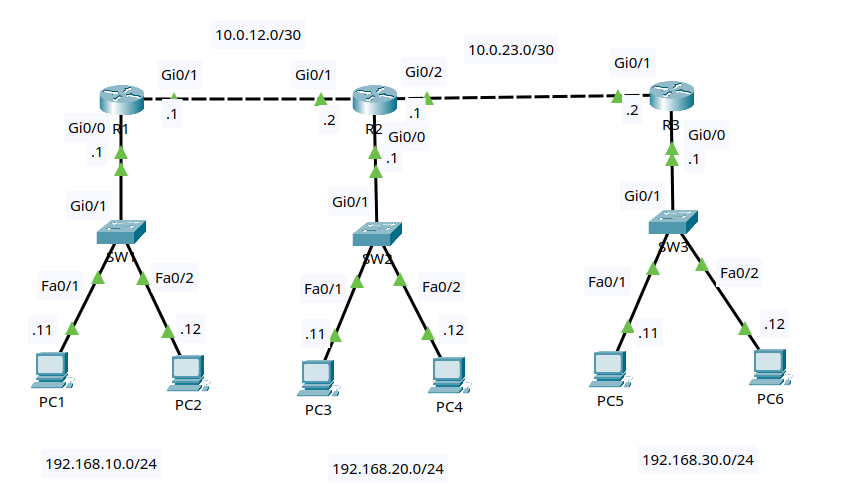

# Lab 1: IPv4 Static and Default Routes

## Goal

Build a three-router network and manually provide reachability between three
LANs. You will distinguish connected, local, static, and default routes;
observe why routing must work in both directions; and verify the forwarding
path with `ping`, `tracert`, and IOS show commands.

No dynamic routing protocol is used in this lab.

## Lab files

- Packet Tracer activity: build and save as
  `packet-tracer/lab-01-ipv4-static-and-default-routes.pkt`
  - Topology image: [images/topology.png](images/topology.png)

## Topology



Use three Cisco 2911 routers, three Cisco 2960 switches, and six PCs.

```text
             10.0.12.0/30 link                   10.0.23.0/30 link
       10.0.12.1          10.0.12.2       10.0.23.1          10.0.23.2
       R1 Gi0/1 ---------- Gi0/1 R2 Gi0/2 ---------- Gi0/1 R3
          Gi0/0                Gi0/0                     Gi0/0
            |                    |                         |
          Gi0/1                Gi0/1                     Gi0/1
           SW1                  SW2                       SW3
         /     \              /     \                   /     \
     Fa0/1   Fa0/2        Fa0/1   Fa0/2             Fa0/1   Fa0/2
       |       |            |       |                 |       |
     PC-A    PC-B          PC-C    PC-D               PC-E    PC-F

  192.168.10.0/24       192.168.20.0/24            192.168.30.0/24
```

R1 and R3 are stub routers: each has only one path toward all remote
networks. R2 is the central transit router and needs a specific route toward
each remote LAN.

### Cabling table

| Device | Port | Connects to | Port |
|---|---|---|---|
| R1 | Gi0/0 | SW1 | Gi0/1 |
| R1 | Gi0/1 | R2 | Gi0/1 |
| R2 | Gi0/0 | SW2 | Gi0/1 |
| R2 | Gi0/2 | R3 | Gi0/1 |
| R3 | Gi0/0 | SW3 | Gi0/1 |
| PC-A | FastEthernet0 | SW1 | Fa0/1 |
| PC-B | FastEthernet0 | SW1 | Fa0/2 |
| PC-C | FastEthernet0 | SW2 | Fa0/1 |
| PC-D | FastEthernet0 | SW2 | Fa0/2 |
| PC-E | FastEthernet0 | SW3 | Fa0/1 |
| PC-F | FastEthernet0 | SW3 | Fa0/2 |

Packet Tracer's **Automatically Choose Connection Type** option is suitable
for every link. If your router model uses interface names such as `Gi0/0/0`,
substitute its names consistently throughout the lab.

## Addressing plan

| Device | Interface | IP address | Mask | Default gateway |
|---|---|---|---|---|
| R1 | Gi0/0 | 192.168.10.1 | 255.255.255.0 | N/A |
| R1 | Gi0/1 | 10.0.12.1 | 255.255.255.252 | N/A |
| R2 | Gi0/0 | 192.168.20.1 | 255.255.255.0 | N/A |
| R2 | Gi0/1 | 10.0.12.2 | 255.255.255.252 | N/A |
| R2 | Gi0/2 | 10.0.23.1 | 255.255.255.252 | N/A |
| R3 | Gi0/0 | 192.168.30.1 | 255.255.255.0 | N/A |
| R3 | Gi0/1 | 10.0.23.2 | 255.255.255.252 | N/A |
| PC-A | FastEthernet0 | 192.168.10.11 | 255.255.255.0 | 192.168.10.1 |
| PC-B | FastEthernet0 | 192.168.10.12 | 255.255.255.0 | 192.168.10.1 |
| PC-C | FastEthernet0 | 192.168.20.11 | 255.255.255.0 | 192.168.20.1 |
| PC-D | FastEthernet0 | 192.168.20.12 | 255.255.255.0 | 192.168.20.1 |
| PC-E | FastEthernet0 | 192.168.30.11 | 255.255.255.0 | 192.168.30.1 |
| PC-F | FastEthernet0 | 192.168.30.12 | 255.255.255.0 | 192.168.30.1 |

The `/30` transit networks each provide two usable addresses:

- `10.0.12.0/30`: usable addresses `.1` and `.2`, broadcast `.3`
- `10.0.23.0/30`: usable addresses `.1` and `.2`, broadcast `.3`

## Routing plan

| Router | Destination | Prefix | Next hop | Route type |
|---|---|---|---|---|
| R1 | Any nonmatching network | 0.0.0.0/0 | 10.0.12.2 | Default |
| R2 | LAN 1 | 192.168.10.0/24 | 10.0.12.1 | Static |
| R2 | LAN 3 | 192.168.30.0/24 | 10.0.23.2 | Static |
| R3 | Any nonmatching network | 0.0.0.0/0 | 10.0.23.1 | Default |

R2 does not need a static route for `192.168.20.0/24`, `10.0.12.0/30`, or
`10.0.23.0/30` because they are directly connected.

## Lab tasks

Try each task from the requirements first. Use the commands below as a
reference if you get stuck.

### Task 1 - Build and name the devices

1. Add three 2911 routers, three 2960 switches, and six PCs.
2. Cable the devices according to the cabling table.
3. Rename the devices `R1`, `R2`, `R3`, `SW1`, `SW2`, and `SW3`.
4. Save the project as `lab-01-ipv4-static-and-default-routes.pkt`.

On each router and switch, substitute the correct hostname:

```ios
enable
configure terminal
hostname R1
no ip domain-lookup
end
```

### Task 2 - Configure the PCs

On each PC, open **Desktop > IP Configuration** and enter its IP address,
subnet mask, and default gateway from the addressing table.

Each default gateway is the router interface in the PC's own subnet. For
example, PC-E uses `192.168.30.1`, not an address on either transit link.

### Task 3 - Configure the LAN interfaces

On R1:

```ios
configure terminal
interface gi0/0
 description LAN_192.168.10.0/24
 ip address 192.168.10.1 255.255.255.0
 no shutdown
end
```

On R2:

```ios
configure terminal
interface gi0/0
 description LAN_192.168.20.0/24
 ip address 192.168.20.1 255.255.255.0
 no shutdown
end
```

On R3:

```ios
configure terminal
interface gi0/0
 description LAN_192.168.30.0/24
 ip address 192.168.30.1 255.255.255.0
 no shutdown
end
```

Checkpoint: each PC should be able to ping its own default gateway and the
other PC on its LAN.

### Task 4 - Configure the router-to-router links

On R1:

```ios
configure terminal
interface gi0/1
 description TRANSIT_TO_R2
 ip address 10.0.12.1 255.255.255.252
 no shutdown
end
```

On R2:

```ios
configure terminal
interface gi0/1
 description TRANSIT_TO_R1
 ip address 10.0.12.2 255.255.255.252
 no shutdown
interface gi0/2
 description TRANSIT_TO_R3
 ip address 10.0.23.1 255.255.255.252
 no shutdown
end
```

On R3:

```ios
configure terminal
interface gi0/1
 description TRANSIT_TO_R2
 ip address 10.0.23.2 255.255.255.252
 no shutdown
end
```

Verify:

```ios
show ip interface brief
show interfaces description
```

All configured router interfaces should be `up/up`. Test each transit link:

```text
R1# ping 10.0.12.2
R2# ping 10.0.23.2
```

### Task 5 - Inspect the connected routing tables

Run on all three routers:

```ios
show ip route
show ip route connected
```

Before static routes are added, IOS knows only directly connected networks
and the router's own interface addresses.

Common route codes are:

| Code | Meaning |
|---|---|
| `C` | Connected network |
| `L` | Local `/32` interface address |
| `S` | Static route |
| `S*` | Candidate static default route |

From PC-A, test a local and a remote destination:

```text
PC-A> ping 192.168.10.12
PC-A> ping 192.168.30.11
```

The local ping should succeed. The remote ping should fail because R1 does
not yet have a route to the destination.

### Task 6 - Configure the R1 default route

R1 has only one path to every remote network, so use a default route pointing
to R2:

```ios
configure terminal
ip route 0.0.0.0 0.0.0.0 10.0.12.2
end
show ip route static
```

Expected entry:

```text
S*  0.0.0.0/0 [1/0] via 10.0.12.2
```

The `*` marks a candidate default route. The values `[1/0]` are the
administrative distance and metric.

Ping `192.168.30.11` from PC-A again. It should still fail: R1 can now send
the request toward R2, but the remaining routers do not yet have every route
needed for the forward and return paths.

### Task 7 - Configure specific routes on R2

R2 has two possible directions, so configure a route for each remote LAN:

```ios
configure terminal
ip route 192.168.10.0 255.255.255.0 10.0.12.1
ip route 192.168.30.0 255.255.255.0 10.0.23.2
end
show ip route static
```

Expected entries:

```text
S   192.168.10.0/24 [1/0] via 10.0.12.1
S   192.168.30.0/24 [1/0] via 10.0.23.2
```

The next-hop addresses are in directly connected transit networks, so IOS can
resolve the outgoing interface. This is called a recursive static route.

### Task 8 - Configure the R3 default route

R3 is also a stub router. Point its default route toward R2:

```ios
configure terminal
ip route 0.0.0.0 0.0.0.0 10.0.23.1
end
show ip route static
```

R1 and R3 now use their only possible path for remote traffic, while R2 has
specific routes that select the correct direction.

### Task 9 - Verify end-to-end connectivity

From PC-A:

```text
PC-A> ping 192.168.20.11
PC-A> ping 192.168.30.11
PC-A> tracert 192.168.30.11
```

From PC-E:

```text
PC-E> ping 192.168.20.11
PC-E> ping 192.168.10.11
PC-E> tracert 192.168.10.11
```

All pings should succeed. Repeat a first ping if ARP resolution causes an
initial timeout.

The PC-A to PC-E trace should pass through these router addresses:

```text
192.168.10.1 -> 10.0.12.2 -> 10.0.23.2
```

The last router may appear using another one of its interface addresses
depending on how IOS sources the ICMP response.

### Task 10 - Follow one packet and its reply

For a ping from PC-A to PC-E:

1. PC-A sees that `192.168.30.11` is outside its local `/24` and sends the
   packet to its default gateway, R1.
2. R1 uses `0.0.0.0/0` and forwards the packet to `10.0.12.2`.
3. R2 uses its more-specific `192.168.30.0/24` route and forwards the packet
   to `10.0.23.2`.
4. R3 uses its connected route to deliver the request to PC-E.
5. PC-E sends the reply to R3 because `192.168.10.11` is remote.
6. R3 uses its default route, R2 uses its `192.168.10.0/24` route, and R1
   uses its connected LAN route to return the reply to PC-A.

Routers make an independent forwarding decision for every packet. A working
forward path does not guarantee a working return path.

### Task 11 - Examine route selection

On R1, compare the route used for a local destination with the route used for
a remote destination:

```ios
show ip route 192.168.10.11
show ip route 192.168.30.11
```

R1 selects its connected `/24` for the local host and its `/0` default for
the remote host. Routers choose the matching route with the longest prefix;
a default route is used only when no more-specific route matches.

On R2:

```ios
show ip route 192.168.10.11
show ip route 192.168.20.11
show ip route 192.168.30.11
```

The results should identify a static, connected, and static route,
respectively.

### Task 12 - Save and perform final verification

Run on every router and switch:

```ios
copy running-config startup-config
```

On each router:

```ios
show ip interface brief
show ip route
show ip route static
show arp
show running-config | include ^ip route
```

Perform at least one successful ping from every LAN to both other LANs.

## Static-route syntax notes

This lab uses a next-hop address:

```ios
ip route network mask next-hop-address
```

IOS also accepts an exit interface or both an exit interface and next hop:

```ios
ip route network mask exit-interface
ip route network mask exit-interface next-hop-address
```

On an Ethernet link, specifying the next-hop address avoids treating every
destination as if it were directly reachable on that Ethernet segment. A
route containing both the interface and next hop is called fully specified.
Use the next-hop form shown in the tasks for this topology.

To remove a route, enter `no` before the exact command:

```ios
no ip route 192.168.30.0 255.255.255.0 10.0.23.2
```

## Troubleshooting challenges

Save the working configuration first. Introduce one fault at a time, diagnose
it with show commands, and then restore the correct configuration.

1. Change PC-E's default gateway to `192.168.30.254`. Confirm that PC-E can
   still ping PC-F but cannot reach a remote LAN.
2. Remove R2's route to `192.168.10.0/24`. Test traffic in both directions
   and identify where the return path stops.
3. Configure R2's route to LAN 3 with the incorrect next hop `10.0.12.1`.
   Use `tracert` and `show ip route 192.168.30.11` to find the wrong direction.
4. Change R1's transit mask to `/24`. Compare `show ip interface brief` and
   `show ip route connected` with the addressing plan.
5. Shut down R2 Gi0/2. Observe the connected and static routes before
   restoring the interface.
6. Replace R3's default route with a route only to `192.168.10.0/24`.
   Determine which remote LAN R3 can reach and explain why.
7. Add `ip route 192.168.30.0 255.255.255.0 10.0.12.2` on R1. Use longest
   prefix matching to predict which entry R1 uses instead of its default.

## Completion checklist

- Every router interface has the correct address, mask, description, and
  `up/up` state.
- Every PC has the correct IP address, mask, and default gateway.
- Adjacent routers can ping each other across both `/30` links.
- R1 and R3 each have an `S*` default route toward R2.
- R2 has static `/24` routes toward the R1 and R3 LANs.
- Each router's connected and local routes match its configured interfaces.
- Hosts on every LAN can reach hosts on both remote LANs.
- `tracert` shows the expected router path across the topology.
- You can explain why both a forward route and a return route are required.
- You can explain why a `/24` route wins over a `/0` default route.
- Running configurations are saved.
