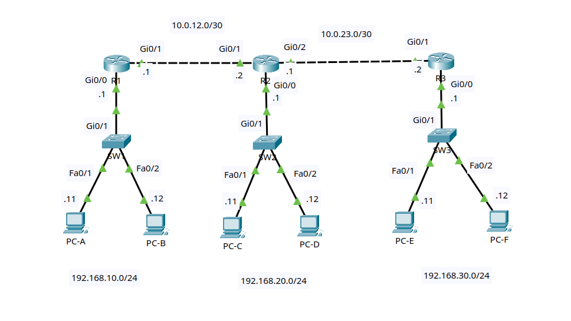

# Lab 1: Single-Area OSPFv2

Status: complete.

## Goal

Build a three-router IPv4 network and use single-area OSPFv2 to provide
dynamic reachability between all LANs. You will configure router IDs, OSPF
network statements, passive interfaces, neighbor adjacencies, and route
verification commands.

All routers are in OSPF area 0.

## Lab files

- Packet Tracer activity: [packet-tracer/01-single-area-ospfv2.pkt](packet-tracer/01-single-area-ospfv2.pkt)
- Topology image: [images/topology.png](images/topology.png)

## Topology



Use three Cisco 2911 routers, three Cisco 2960 switches, and six PCs.

```text
             10.0.12.0/30 link                   10.0.23.0/30 link
       10.0.12.1          10.0.12.2       10.0.23.1          10.0.23.2
       R1 Gi0/1 ---------- Gi0/1 R2 Gi0/2 ---------- Gi0/1 R3
          Gi0/0                Gi0/0                     Gi0/0
            |                    |                         |
          Gi0/1                Gi0/1                     Gi0/1
           SW1                  SW2                       SW3
         /     \              /     \                   /     \
     Fa0/1   Fa0/2        Fa0/1   Fa0/2             Fa0/1   Fa0/2
       |       |            |       |                 |       |
     PC-A    PC-B          PC-C    PC-D               PC-E    PC-F

  192.168.10.0/24       192.168.20.0/24            192.168.30.0/24
```

R1 and R3 each form one OSPF neighbor relationship with R2. R2 is the transit
router between the left and right side of the topology.

### Cabling table

| Device | Port | Connects to | Port |
|---|---|---|---|
| R1 | Gi0/0 | SW1 | Gi0/1 |
| R1 | Gi0/1 | R2 | Gi0/1 |
| R2 | Gi0/0 | SW2 | Gi0/1 |
| R2 | Gi0/2 | R3 | Gi0/1 |
| R3 | Gi0/0 | SW3 | Gi0/1 |
| PC-A | FastEthernet0 | SW1 | Fa0/1 |
| PC-B | FastEthernet0 | SW1 | Fa0/2 |
| PC-C | FastEthernet0 | SW2 | Fa0/1 |
| PC-D | FastEthernet0 | SW2 | Fa0/2 |
| PC-E | FastEthernet0 | SW3 | Fa0/1 |
| PC-F | FastEthernet0 | SW3 | Fa0/2 |

Packet Tracer's **Automatically Choose Connection Type** option is suitable
for every link. If your router model uses interface names such as `Gi0/0/0`,
substitute its names consistently throughout the lab.

## Addressing plan

| Device | Interface | IP address | Mask | Default gateway |
|---|---|---|---|---|
| R1 | Gi0/0 | 192.168.10.1 | 255.255.255.0 | N/A |
| R1 | Gi0/1 | 10.0.12.1 | 255.255.255.252 | N/A |
| R2 | Gi0/0 | 192.168.20.1 | 255.255.255.0 | N/A |
| R2 | Gi0/1 | 10.0.12.2 | 255.255.255.252 | N/A |
| R2 | Gi0/2 | 10.0.23.1 | 255.255.255.252 | N/A |
| R3 | Gi0/0 | 192.168.30.1 | 255.255.255.0 | N/A |
| R3 | Gi0/1 | 10.0.23.2 | 255.255.255.252 | N/A |
| PC-A | FastEthernet0 | 192.168.10.11 | 255.255.255.0 | 192.168.10.1 |
| PC-B | FastEthernet0 | 192.168.10.12 | 255.255.255.0 | 192.168.10.1 |
| PC-C | FastEthernet0 | 192.168.20.11 | 255.255.255.0 | 192.168.20.1 |
| PC-D | FastEthernet0 | 192.168.20.12 | 255.255.255.0 | 192.168.20.1 |
| PC-E | FastEthernet0 | 192.168.30.11 | 255.255.255.0 | 192.168.30.1 |
| PC-F | FastEthernet0 | 192.168.30.12 | 255.255.255.0 | 192.168.30.1 |

## OSPF plan

| Router | Process ID | Router ID | Advertised networks | Non-passive interfaces |
|---|---:|---|---|---|
| R1 | 10 | 1.1.1.1 | `192.168.10.0/24`, `10.0.12.0/30` | Gi0/1 |
| R2 | 10 | 2.2.2.2 | `192.168.20.0/24`, `10.0.12.0/30`, `10.0.23.0/30` | Gi0/1, Gi0/2 |
| R3 | 10 | 3.3.3.3 | `192.168.30.0/24`, `10.0.23.0/30` | Gi0/1 |

The OSPF process ID is locally significant. It does not need to match between
routers, but this lab uses process `10` everywhere to keep the configuration
easy to read.

LAN interfaces are advertised into OSPF so other routers can learn the LAN
routes. They are also made passive so the routers do not send OSPF hello
packets toward PCs and switches.

## Lab tasks

Try each task from the requirements first. Use the commands below as a
reference if you get stuck.

### Task 1 - Build and name the devices

1. Add three 2911 routers, three 2960 switches, and six PCs.
2. Cable the devices according to the cabling table.
3. Rename the devices `R1`, `R2`, `R3`, `SW1`, `SW2`, and `SW3`.
4. Save the project as `01-single-area-ospfv2.pkt`.

On each router and switch, substitute the correct hostname:

```ios
enable
configure terminal
hostname R1
no ip domain-lookup
end
```

### Task 2 - Configure the PCs

On each PC, open **Desktop > IP Configuration** and enter its IP address,
subnet mask, and default gateway from the addressing table.

Each PC uses the router interface in its own LAN as the default gateway. For
example, PC-A uses `192.168.10.1`.

### Task 3 - Configure the LAN interfaces

On R1:

```ios
configure terminal
interface gi0/0
 description LAN_192.168.10.0/24
 ip address 192.168.10.1 255.255.255.0
 no shutdown
end
```

On R2:

```ios
configure terminal
interface gi0/0
 description LAN_192.168.20.0/24
 ip address 192.168.20.1 255.255.255.0
 no shutdown
end
```

On R3:

```ios
configure terminal
interface gi0/0
 description LAN_192.168.30.0/24
 ip address 192.168.30.1 255.255.255.0
 no shutdown
end
```

Checkpoint: each PC should be able to ping its own default gateway and the
other PC on its LAN.

### Task 4 - Configure the router-to-router links

On R1:

```ios
configure terminal
interface gi0/1
 description TRANSIT_TO_R2
 ip address 10.0.12.1 255.255.255.252
 no shutdown
end
```

On R2:

```ios
configure terminal
interface gi0/1
 description TRANSIT_TO_R1
 ip address 10.0.12.2 255.255.255.252
 no shutdown
interface gi0/2
 description TRANSIT_TO_R3
 ip address 10.0.23.1 255.255.255.252
 no shutdown
end
```

On R3:

```ios
configure terminal
interface gi0/1
 description TRANSIT_TO_R2
 ip address 10.0.23.2 255.255.255.252
 no shutdown
end
```

Verify:

```ios
show ip interface brief
show interfaces description
```

All configured router interfaces should be `up/up`. Test each transit link:

```text
R1# ping 10.0.12.2
R2# ping 10.0.23.2
```

### Task 5 - Inspect routing before OSPF

Run on all three routers:

```ios
show ip route
show ip route connected
```

Before OSPF is configured, IOS knows only directly connected networks and the
router's own local interface addresses.

From PC-A:

```text
PC-A> ping 192.168.20.11
PC-A> ping 192.168.30.11
```

Both remote pings should fail because no router has learned the remote LANs
yet.

### Task 6 - Configure OSPF on R1

```ios
configure terminal
router ospf 10
 router-id 1.1.1.1
 passive-interface default
 no passive-interface gi0/1
 network 192.168.10.0 0.0.0.255 area 0
 network 10.0.12.0 0.0.0.3 area 0
end
```

Verify the local OSPF configuration:

```ios
show ip protocols
show ip ospf interface brief
```

R1 will not have an OSPF neighbor until R2 is configured.

### Task 7 - Configure OSPF on R2

```ios
configure terminal
router ospf 10
 router-id 2.2.2.2
 passive-interface default
 no passive-interface gi0/1
 no passive-interface gi0/2
 network 192.168.20.0 0.0.0.255 area 0
 network 10.0.12.0 0.0.0.3 area 0
 network 10.0.23.0 0.0.0.3 area 0
end
```

Check the first neighbor relationship:

```ios
show ip ospf neighbor
```

Expected result on R2:

```text
Neighbor ID     Pri   State           Dead Time   Address         Interface
1.1.1.1           1   FULL/DR         00:00:xx    10.0.12.1       GigabitEthernet0/1
```

The exact `DR` or `BDR` role can vary. The important state is `FULL`.

### Task 8 - Configure OSPF on R3

```ios
configure terminal
router ospf 10
 router-id 3.3.3.3
 passive-interface default
 no passive-interface gi0/1
 network 192.168.30.0 0.0.0.255 area 0
 network 10.0.23.0 0.0.0.3 area 0
end
```

Check OSPF neighbors on every router:

```ios
show ip ospf neighbor
```

Expected neighbor count:

| Router | Expected neighbors |
|---|---:|
| R1 | 1 |
| R2 | 2 |
| R3 | 1 |

### Task 9 - Verify OSPF routes

Run on each router:

```ios
show ip route ospf
show ip route
```

R1 should learn these OSPF routes:

```text
O    192.168.20.0/24 [110/2] via 10.0.12.2
O    192.168.30.0/24 [110/3] via 10.0.12.2
O    10.0.23.0/30 [110/2] via 10.0.12.2
```

R3 should learn these OSPF routes:

```text
O    192.168.20.0/24 [110/2] via 10.0.23.1
O    192.168.10.0/24 [110/3] via 10.0.23.1
O    10.0.12.0/30 [110/2] via 10.0.23.1
```

R2 should learn both remote edge LANs:

```text
O    192.168.10.0/24 [110/2] via 10.0.12.1
O    192.168.30.0/24 [110/2] via 10.0.23.2
```

The exact OSPF cost can vary by platform and interface bandwidth settings.
Focus on the `O` route code, destination network, next hop, and outgoing
direction.

### Task 10 - Verify end-to-end connectivity

From PC-A:

```text
PC-A> ping 192.168.20.11
PC-A> ping 192.168.30.11
PC-A> tracert 192.168.30.11
```

From PC-E:

```text
PC-E> ping 192.168.20.11
PC-E> ping 192.168.10.11
PC-E> tracert 192.168.10.11
```

All pings should succeed. Repeat a first ping if ARP resolution causes an
initial timeout.

The PC-A to PC-E trace should pass through these router addresses:

```text
192.168.10.1 -> 10.0.12.2 -> 10.0.23.2
```

The last router may appear using another one of its interface addresses
depending on how IOS sources the ICMP response.

### Task 11 - Inspect the OSPF database

On each router:

```ios
show ip ospf database
show ip ospf database router
```

Each router should have the same link-state database for area 0 after the
network converges. OSPF routers calculate their own shortest paths from this
shared database.

### Task 12 - Test passive-interface behavior

On R1, confirm that Gi0/0 is advertised but passive:

```ios
show ip ospf interface gi0/0
show ip protocols
```

Gi0/0 should appear as passive in the routing protocol output. The LAN is
still advertised, but OSPF hellos are not sent toward SW1 or the PCs.

### Task 13 - Save and perform final verification

Run on every router and switch:

```ios
copy running-config startup-config
```

On each router:

```ios
show ip interface brief
show ip protocols
show ip ospf neighbor
show ip route ospf
show running-config | section router ospf
```

Perform at least one successful ping from every LAN to both other LANs.

## OSPF syntax notes

The `network` command uses a wildcard mask, not a subnet mask:

```ios
network 192.168.10.0 0.0.0.255 area 0
network 10.0.12.0 0.0.0.3 area 0
```

A wildcard mask is the inverse of a subnet mask:

| Subnet mask | Wildcard mask |
|---|---|
| 255.255.255.0 | 0.0.0.255 |
| 255.255.255.252 | 0.0.0.3 |

Router IDs are selected when the OSPF process starts. If you change a router
ID after OSPF is already running, restart the process:

```ios
clear ip ospf process
```

Confirm the prompt before continuing. OSPF will rebuild adjacencies after the
process restarts.

## Troubleshooting challenges

Save the working configuration first. Introduce one fault at a time, diagnose
it with show commands, and then restore the correct configuration.

1. Remove `no passive-interface gi0/1` from R1. Confirm that the R1-R2
   neighbor relationship disappears.
2. Change R3's OSPF area from `area 0` to `area 1` on the transit network.
   Use `show ip ospf neighbor` to confirm that R2 and R3 no longer become
   neighbors.
3. Configure R2's Gi0/2 with the wrong subnet mask. Use `show ip interface
   brief` and `show ip ospf interface brief` to compare addressing and OSPF
   participation.
4. Remove R1's LAN `network` command. Confirm that R2 and R3 no longer learn
   `192.168.10.0/24`.
5. Change PC-F's default gateway to `192.168.30.254`. Confirm that PC-F can
   still reach PC-E but cannot reach remote LANs.
6. Shut down R2 Gi0/2. Observe the neighbor table and OSPF routes before
   restoring the interface.
7. Change R1's router ID to `9.9.9.9`, clear the OSPF process, and identify
   the new neighbor ID from R2.

## Completion checklist

- Every router interface has the correct address, mask, description, and
  `up/up` state.
- Every PC has the correct IP address, mask, and default gateway.
- Adjacent routers can ping each other across both `/30` links.
- OSPF is enabled with process `10` and area `0` on all routers.
- Router IDs are `1.1.1.1`, `2.2.2.2`, and `3.3.3.3`.
- LAN interfaces are advertised into OSPF and kept passive.
- Transit interfaces are non-passive and form the expected neighbors.
- R1 and R3 each have one OSPF neighbor; R2 has two.
- Each router learns the remote LANs as OSPF routes.
- Hosts on every LAN can reach hosts on both remote LANs.
- You can explain the difference between a subnet mask and a wildcard mask.
- You can explain why passive interfaces still advertise their networks.
- Running configurations are saved.
