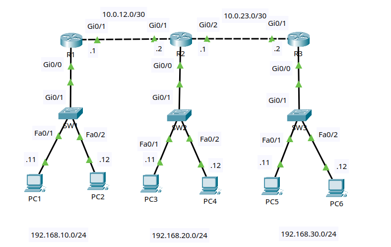

# Lab 1: Static Standard and Extended ACLs

Status: complete.

## Goal

Build a three-router network and apply static IPv4 ACLs to control traffic
between LANs. You will configure a standard ACL, an extended ACL, interface
directions, explicit permits, implicit denies, ACL remarks, and verification
commands.

No dynamic routing protocol is used in this lab. Static routes are included so
you can focus on ACL behavior.

## Lab files

- Packet Tracer activity: [packet-tracer/01-static-acl.pkt](packet-tracer/01-static-acl.pkt)
- Topology image: [images/topology.png](images/topology.png)

## Topology



Use three Cisco 2911 routers, three Cisco 2960 switches, and six PCs.

```text
             10.0.12.0/30 link                   10.0.23.0/30 link
       10.0.12.1          10.0.12.2       10.0.23.1          10.0.23.2
       R1 Gi0/1 ---------- Gi0/1 R2 Gi0/2 ---------- Gi0/1 R3
          Gi0/0                Gi0/0                     Gi0/0
            |                    |                         |
          Gi0/1                Gi0/1                     Gi0/1
           SW1                  SW2                       SW3
         /     \              /     \                   /     \
     Fa0/1   Fa0/2        Fa0/1   Fa0/2             Fa0/1   Fa0/2
       |       |            |       |                 |       |
     PC-A    PC-B          PC-C    PC-D               PC-E    PC-F

  192.168.10.0/24       192.168.20.0/24            192.168.30.0/24
```

### Cabling table

| Device | Port | Connects to | Port |
|---|---|---|---|
| R1 | Gi0/0 | SW1 | Gi0/1 |
| R1 | Gi0/1 | R2 | Gi0/1 |
| R2 | Gi0/0 | SW2 | Gi0/1 |
| R2 | Gi0/2 | R3 | Gi0/1 |
| R3 | Gi0/0 | SW3 | Gi0/1 |
| PC-A | FastEthernet0 | SW1 | Fa0/1 |
| PC-B | FastEthernet0 | SW1 | Fa0/2 |
| PC-C | FastEthernet0 | SW2 | Fa0/1 |
| PC-D | FastEthernet0 | SW2 | Fa0/2 |
| PC-E | FastEthernet0 | SW3 | Fa0/1 |
| PC-F | FastEthernet0 | SW3 | Fa0/2 |

Packet Tracer's **Automatically Choose Connection Type** option is suitable
for every link. If your router model uses interface names such as `Gi0/0/0`,
substitute its names consistently throughout the lab.

## Addressing plan

| Device | Interface | IP address | Mask | Default gateway |
|---|---|---|---|---|
| R1 | Gi0/0 | 192.168.10.1 | 255.255.255.0 | N/A |
| R1 | Gi0/1 | 10.0.12.1 | 255.255.255.252 | N/A |
| R2 | Gi0/0 | 192.168.20.1 | 255.255.255.0 | N/A |
| R2 | Gi0/1 | 10.0.12.2 | 255.255.255.252 | N/A |
| R2 | Gi0/2 | 10.0.23.1 | 255.255.255.252 | N/A |
| R3 | Gi0/0 | 192.168.30.1 | 255.255.255.0 | N/A |
| R3 | Gi0/1 | 10.0.23.2 | 255.255.255.252 | N/A |
| PC-A | FastEthernet0 | 192.168.10.11 | 255.255.255.0 | 192.168.10.1 |
| PC-B | FastEthernet0 | 192.168.10.12 | 255.255.255.0 | 192.168.10.1 |
| PC-C | FastEthernet0 | 192.168.20.11 | 255.255.255.0 | 192.168.20.1 |
| PC-D | FastEthernet0 | 192.168.20.12 | 255.255.255.0 | 192.168.20.1 |
| PC-E | FastEthernet0 | 192.168.30.11 | 255.255.255.0 | 192.168.30.1 |
| PC-F | FastEthernet0 | 192.168.30.12 | 255.255.255.0 | 192.168.30.1 |

## Routing plan

| Router | Destination | Prefix | Next hop | Route type |
|---|---|---|---|---|
| R1 | Any nonmatching network | 0.0.0.0/0 | 10.0.12.2 | Default |
| R2 | LAN 1 | 192.168.10.0/24 | 10.0.12.1 | Static |
| R2 | LAN 3 | 192.168.30.0/24 | 10.0.23.2 | Static |
| R3 | Any nonmatching network | 0.0.0.0/0 | 10.0.23.1 | Default |

## ACL policy

| Policy | ACL type | Router/interface | Direction |
|---|---|---|---|
| Block PC-B from reaching LAN 3, but allow the rest of LAN 1 to LAN 3 | Extended named ACL | R1 Gi0/1 | Out |
| Block all LAN 3 hosts from reaching LAN 2, but allow other traffic | Standard numbered ACL | R2 Gi0/0 | Out |

The extended ACL is placed close to the source because it can identify both
source and destination. The standard ACL is placed close to the destination
because it can match only source addresses.

## Lab tasks

Try each task from the requirements first. Use the commands below as a
reference if you get stuck.

### Task 1 - Build and name the devices

1. Add three 2911 routers, three 2960 switches, and six PCs.
2. Cable the devices according to the cabling table.
3. Rename the devices `R1`, `R2`, `R3`, `SW1`, `SW2`, and `SW3`.
4. Save the project as `01-static-acl.pkt`.

On each router and switch, substitute the correct hostname:

```ios
enable
configure terminal
hostname R1
no ip domain-lookup
end
```

### Task 2 - Configure IP addressing

Configure each PC through **Desktop > IP Configuration**.

Configure R1:

```ios
configure terminal
interface gi0/0
 description LAN_192.168.10.0/24
 ip address 192.168.10.1 255.255.255.0
 no shutdown
interface gi0/1
 description TRANSIT_TO_R2
 ip address 10.0.12.1 255.255.255.252
 no shutdown
end
```

Configure R2:

```ios
configure terminal
interface gi0/0
 description LAN_192.168.20.0/24
 ip address 192.168.20.1 255.255.255.0
 no shutdown
interface gi0/1
 description TRANSIT_TO_R1
 ip address 10.0.12.2 255.255.255.252
 no shutdown
interface gi0/2
 description TRANSIT_TO_R3
 ip address 10.0.23.1 255.255.255.252
 no shutdown
end
```

Configure R3:

```ios
configure terminal
interface gi0/0
 description LAN_192.168.30.0/24
 ip address 192.168.30.1 255.255.255.0
 no shutdown
interface gi0/1
 description TRANSIT_TO_R2
 ip address 10.0.23.2 255.255.255.252
 no shutdown
end
```

Verify:

```ios
show ip interface brief
show interfaces description
```

### Task 3 - Configure static routes

On R1:

```ios
configure terminal
ip route 0.0.0.0 0.0.0.0 10.0.12.2
end
```

On R2:

```ios
configure terminal
ip route 192.168.10.0 255.255.255.0 10.0.12.1
ip route 192.168.30.0 255.255.255.0 10.0.23.2
end
```

On R3:

```ios
configure terminal
ip route 0.0.0.0 0.0.0.0 10.0.23.1
end
```

Before applying ACLs, confirm full reachability:

```text
PC-A> ping 192.168.30.11
PC-B> ping 192.168.30.11
PC-E> ping 192.168.20.11
PC-C> ping 192.168.10.11
```

All pings should succeed.

### Task 4 - Configure the extended ACL on R1

Create a named extended ACL that blocks only PC-B from LAN 3 and then permits
all other IPv4 traffic.

On R1:

```ios
configure terminal
ip access-list extended LAN1_TO_LAN3_FILTER
 remark Block PC-B from reaching LAN 3
 deny ip host 192.168.10.12 192.168.30.0 0.0.0.255
 remark Allow all other traffic
 permit ip any any
exit
interface gi0/1
 ip access-group LAN1_TO_LAN3_FILTER out
end
```

Test:

```text
PC-A> ping 192.168.30.11
PC-B> ping 192.168.30.11
PC-B> ping 192.168.20.11
```

Expected result:

| Test | Expected |
|---|---|
| PC-A to PC-E | Succeeds |
| PC-B to PC-E | Fails |
| PC-B to PC-C | Succeeds |

PC-B can still reach LAN 2 because the deny statement is specific to the
`192.168.30.0/24` destination.

### Task 5 - Configure the standard ACL on R2

Create a standard ACL that blocks source network `192.168.30.0/24` from
leaving R2 toward LAN 2.

On R2:

```ios
configure terminal
access-list 10 remark Block LAN 3 from reaching LAN 2
access-list 10 deny 192.168.30.0 0.0.0.255
access-list 10 permit any
interface gi0/0
 ip access-group 10 out
end
```

Test:

```text
PC-E> ping 192.168.20.11
PC-E> ping 192.168.10.11
PC-C> ping 192.168.30.11
```

Expected result:

| Test | Expected |
|---|---|
| PC-E to PC-C | Fails |
| PC-E to PC-A | Succeeds |
| PC-C to PC-E | Fails or unreliable because return traffic is filtered |

The final test is useful: a ping from LAN 2 to LAN 3 sends the echo request
out R2 Gi0/2, but the echo reply returns from LAN 3 and is blocked as it
tries to exit R2 Gi0/0 toward LAN 2.

### Task 6 - Verify ACL operation

Run these commands after testing:

```ios
show access-lists
show ip access-lists
show ip interface gi0/1
show ip interface gi0/0
```

On R1, the named ACL should show matches on the PC-B deny statement. On R2,
ACL 10 should show matches when LAN 3 tries to reach LAN 2 or reply to LAN 2.

Clear counters if you want to retest from a clean baseline:

```ios
clear access-list counters
```

## Troubleshooting checklist

- If the wrong traffic is blocked, check whether the ACL is on the correct
  interface and in the correct direction.
- If everything is blocked, look for a missing final `permit ip any any` or
  `permit any`.
- If the ACL has zero matches, the traffic may not be crossing the interface
  where the ACL is applied.
- If a wildcard mask looks backwards, remember that `0.0.0.255` matches a
  `/24`; it is not a subnet mask.

## Cleanup commands

On R1:

```ios
configure terminal
interface gi0/1
 no ip access-group LAN1_TO_LAN3_FILTER out
exit
no ip access-list extended LAN1_TO_LAN3_FILTER
end
```

On R2:

```ios
configure terminal
interface gi0/0
 no ip access-group 10 out
exit
no access-list 10
end
```
