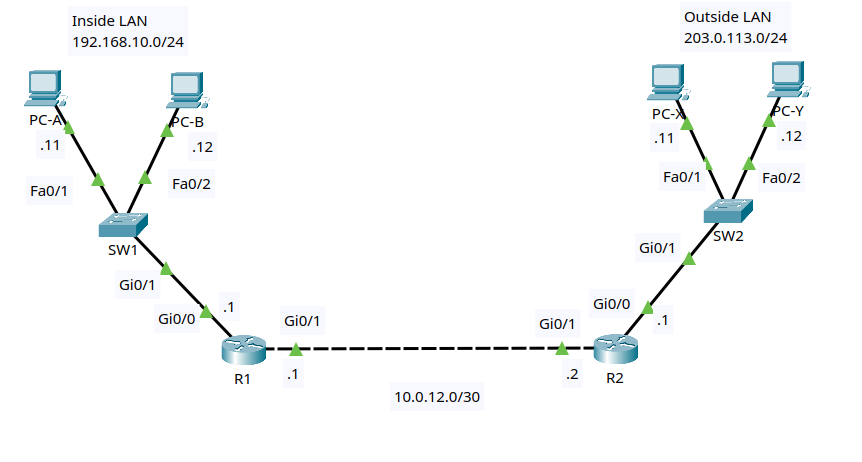

# Lab 2: Extended ACLs for Services

Status: complete.

## Goal

Build a small inside/outside network and use a named extended IPv4 ACL to
control specific traffic from the inside LAN. You will filter ICMP and Telnet
traffic by source, destination, protocol, and port, apply the ACL close to the
source, verify ACL hit counts, and adjust rule order with sequence numbers.

This lab stays within CCNA-level ACL topics. It does not use reflexive ACLs,
dynamic ACLs, or stateful firewall features.

## Lab files

- Packet Tracer activity: [packet-tracer/lab-02-extended-acl-services.pkt](packet-tracer/lab-02-extended-acl-services.pkt)
- Topology image: [images/topology.png](images/topology.png)

## Topology



Use two Cisco 2911 routers, two Cisco 2960 switches, and four PCs.

```text
        Inside LAN                         Outside LAN
      192.168.10.0/24                    203.0.113.0/24

      PC-A     PC-B                       PC-X     PC-Y
       |        |                          |        |
     Fa0/1    Fa0/2                      Fa0/1    Fa0/2
        \      /                            \      /
          SW1                                SW2
          Gi0/1                              Gi0/1
            |                                  |
          Gi0/0                              Gi0/0
            R1 Gi0/1 ---------------- Gi0/1 R2
             10.0.12.1       link       10.0.12.2
                    10.0.12.0/30
```

R1 is the inside edge router. R2 represents the outside network. The ACL is
applied inbound on R1 Gi0/0, close to the inside source hosts.

### Cabling table

| Device | Port | Connects to | Port |
|---|---|---|---|
| R1 | Gi0/0 | SW1 | Gi0/1 |
| R1 | Gi0/1 | R2 | Gi0/1 |
| R2 | Gi0/0 | SW2 | Gi0/1 |
| PC-A | FastEthernet0 | SW1 | Fa0/1 |
| PC-B | FastEthernet0 | SW1 | Fa0/2 |
| PC-X | FastEthernet0 | SW2 | Fa0/1 |
| PC-Y | FastEthernet0 | SW2 | Fa0/2 |

Packet Tracer's **Automatically Choose Connection Type** option is suitable
for every link. If your router model uses interface names such as `Gi0/0/0`,
substitute its names consistently throughout the lab.

## Addressing plan

| Device | Interface | IP address | Mask | Default gateway |
|---|---|---|---|---|
| R1 | Gi0/0 | 192.168.10.1 | 255.255.255.0 | N/A |
| R1 | Gi0/1 | 10.0.12.1 | 255.255.255.252 | N/A |
| R2 | Gi0/0 | 203.0.113.1 | 255.255.255.0 | N/A |
| R2 | Gi0/1 | 10.0.12.2 | 255.255.255.252 | N/A |
| PC-A | FastEthernet0 | 192.168.10.11 | 255.255.255.0 | 192.168.10.1 |
| PC-B | FastEthernet0 | 192.168.10.12 | 255.255.255.0 | 192.168.10.1 |
| PC-X | FastEthernet0 | 203.0.113.11 | 255.255.255.0 | 203.0.113.1 |
| PC-Y | FastEthernet0 | 203.0.113.12 | 255.255.255.0 | 203.0.113.1 |

## Routing plan

| Router | Destination | Prefix | Next hop |
|---|---|---|---|
| R1 | Outside LAN | 203.0.113.0/24 | 10.0.12.2 |
| R2 | Inside LAN | 192.168.10.0/24 | 10.0.12.1 |

## ACL policy

| Requirement | Match |
|---|---|
| PC-A may ping the outside LAN | ICMP from `192.168.10.11` to `203.0.113.0/24` |
| PC-B may not ping the outside LAN | ICMP from `192.168.10.12` to `203.0.113.0/24` |
| PC-A may Telnet to R2 for testing | TCP from `192.168.10.11` to `10.0.12.2` port 23 |
| Other inside hosts may not Telnet to R2 | TCP from `192.168.10.0/24` to `10.0.12.2` port 23 |
| All other IPv4 traffic is allowed | Final explicit permit |

The extended ACL is placed close to the source because it can match source,
destination, protocol, and port details.

## Lab tasks

Try each task from the requirements first. Use the commands below as a
reference if you get stuck.

### Task 1 - Build and name the devices

1. Add two 2911 routers, two 2960 switches, and four PCs.
2. Cable the devices according to the cabling table.
3. Rename the devices `R1`, `R2`, `SW1`, `SW2`, `PC-A`, `PC-B`, `PC-X`, and
   `PC-Y`.
4. Save the project as `lab-02-extended-acl-services.pkt`.

On each router and switch, substitute the correct hostname:

```ios
enable
configure terminal
hostname R1
no ip domain-lookup
end
```

### Task 2 - Configure IP addressing

Configure each PC through **Desktop > IP Configuration**.

Configure R1:

```ios
configure terminal
interface gi0/0
 description INSIDE_LAN
 ip address 192.168.10.1 255.255.255.0
 no shutdown
interface gi0/1
 description OUTSIDE_TO_R2
 ip address 10.0.12.1 255.255.255.252
 no shutdown
end
```

Configure R2:

```ios
configure terminal
interface gi0/0
 description OUTSIDE_LAN
 ip address 203.0.113.1 255.255.255.0
 no shutdown
interface gi0/1
 description TO_R1
 ip address 10.0.12.2 255.255.255.252
 no shutdown
end
```

Verify:

```ios
show ip interface brief
show interfaces description
```

### Task 3 - Configure static routes

On R1:

```ios
configure terminal
ip route 203.0.113.0 255.255.255.0 10.0.12.2
end
```

On R2:

```ios
configure terminal
ip route 192.168.10.0 255.255.255.0 10.0.12.1
end
```

Before applying ACLs, confirm full reachability:

```text
PC-A> ping 203.0.113.11
PC-B> ping 203.0.113.11
PC-X> ping 192.168.10.11
```

All pings should succeed.

### Task 4 - Configure Telnet on R2 for testing

Telnet is used only as a simple service to test TCP port filtering.

On R2:

```ios
configure terminal
username admin secret cisco123
enable secret class
line vty 0 4
 login local
 transport input telnet
end
```

From PC-A and PC-B, confirm Telnet works before the ACL is applied:

```text
PC-A> telnet 10.0.12.2
PC-B> telnet 10.0.12.2
```

Both attempts should reach the username prompt. Exit the Telnet session before
continuing.

### Task 5 - Configure the named extended ACL on R1

Create a named extended ACL that enforces the policy, then apply it inbound on
R1 Gi0/0.

On R1:

```ios
configure terminal
ip access-list extended INSIDE_SERVICE_FILTER
 remark Permit PC-A ICMP to outside LAN
 20 permit icmp host 192.168.10.11 203.0.113.0 0.0.0.255
 remark Block PC-B ICMP to outside LAN
 40 deny icmp host 192.168.10.12 203.0.113.0 0.0.0.255
 remark Permit PC-A Telnet to R2
 60 permit tcp host 192.168.10.11 host 10.0.12.2 eq telnet
 remark Block inside Telnet to R2
 80 deny tcp 192.168.10.0 0.0.0.255 host 10.0.12.2 eq telnet
 remark Permit all other IPv4 traffic
 100 permit ip any any
exit
interface gi0/0
 ip access-group INSIDE_SERVICE_FILTER in
end
```

### Task 6 - Verify ACL behavior

Run these tests:

```text
PC-A> ping 203.0.113.11
PC-B> ping 203.0.113.11
PC-A> telnet 10.0.12.2
PC-B> telnet 10.0.12.2
PC-X> ping 192.168.10.11
```

Expected result:

| Test | Expected |
|---|---|
| PC-A to PC-X ping | Succeeds |
| PC-B to PC-X ping | Fails |
| PC-A Telnet to R2 | Reaches username prompt |
| PC-B Telnet to R2 | Fails |
| PC-X to PC-A ping | Succeeds |

The final test succeeds because the ACL is applied inbound on R1 Gi0/0. It
filters traffic entering R1 from the inside LAN, not traffic entering R1 from
R2.

Check ACL counters:

```ios
show access-lists
show ip access-lists
show ip interface gi0/0
```

The permit and deny lines should show matches after the tests. Clear counters
if you want to retest from a clean baseline:

```ios
clear access-list counters
```

### Task 7 - Adjust the ACL with sequence numbers

Change the policy so PC-B can ping only PC-X, but still cannot ping PC-Y.
Insert the new permit before the broader PC-B deny statement.

On R1:

```ios
configure terminal
ip access-list extended INSIDE_SERVICE_FILTER
 35 permit icmp host 192.168.10.12 host 203.0.113.11
end
```

Test:

```text
PC-B> ping 203.0.113.11
PC-B> ping 203.0.113.12
```

Expected result:

| Test | Expected |
|---|---|
| PC-B to PC-X ping | Succeeds |
| PC-B to PC-Y ping | Fails |

Verify the order:

```ios
show ip access-lists INSIDE_SERVICE_FILTER
```

The new line must appear before the deny statement for PC-B to the outside LAN.

## Troubleshooting checklist

- If the wrong traffic is blocked, check the ACL statement order.
- If everything from the inside LAN is blocked, look for a missing final
  `permit ip any any`.
- If the ACL has zero matches, confirm it is applied inbound on R1 Gi0/0.
- If PC-B can still ping both outside PCs, check whether the deny line uses
  the correct source host and destination wildcard mask.
- If Telnet does not work before applying the ACL, verify the R2 VTY line
  configuration and static routes first.
- If a wildcard mask looks backwards, remember that `0.0.0.255` matches a
  `/24`; it is not a subnet mask.

## Cleanup commands

On R1:

```ios
configure terminal
interface gi0/0
 no ip access-group INSIDE_SERVICE_FILTER in
exit
no ip access-list extended INSIDE_SERVICE_FILTER
end
```

On R2:

```ios
configure terminal
line vty 0 4
 no login local
 transport input all
exit
no username admin
no enable secret
end
```
