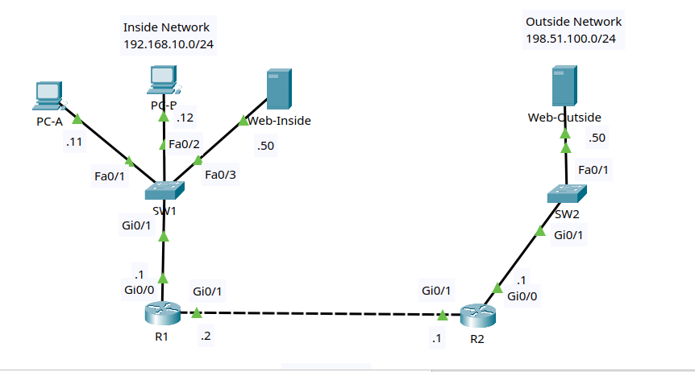

# Lab 1: Static NAT and PAT

## Goal

Build a small inside/outside network and configure two common IPv4 NAT
behaviors on the edge router:

- Static NAT for an inside web server.
- PAT overload for inside users accessing an outside server.

You will identify NAT inside and outside interfaces, create a standard ACL to
match addresses eligible for PAT, configure a static NAT mapping, verify the
translation table, and troubleshoot routing requirements around NAT.

This lab stays within CCNA-level NAT topics. It focuses on static NAT and PAT
overload. A later practice lab can add dynamic NAT with a pool.

## Lab files

- Packet Tracer activity: build and save as
  `packet-tracer/lab-01-static-nat-and-pat.pkt`
- Topology image: [images/topology.png](images/topology.png)

## Topology



Use two Cisco 2911 routers, two Cisco 2960 switches, two PCs, and two
servers. `Web-Inside` and `Web-Outside` are Packet Tracer server devices.

```text
              Inside network                       Outside network
              192.168.10.0/24                      198.51.100.0/24

          PC-A        PC-B       Web-Inside           Web-Outside
           |           |             |                     |
         Fa0/1       Fa0/2         Fa0/3                 Fa0/1
           \           |           /                       |
            \          |          /                        |
                    SW1                                  SW2
                    Gi0/1                                Gi0/1
                      |                                    |
                    Gi0/0                                Gi0/0
                      R1 Gi0/1 ---------------- Gi0/1 R2
                       203.0.113.2     link      203.0.113.1
                              203.0.113.0/30
```

R1 is the NAT edge router. R2 represents the ISP or outside router.

### Cabling table

| Device | Port | Connects to | Port |
|---|---|---|---|
| R1 | Gi0/0 | SW1 | Gi0/1 |
| R1 | Gi0/1 | R2 | Gi0/1 |
| R2 | Gi0/0 | SW2 | Gi0/1 |
| PC-A | FastEthernet0 | SW1 | Fa0/1 |
| PC-B | FastEthernet0 | SW1 | Fa0/2 |
| Web-Inside | FastEthernet0 | SW1 | Fa0/3 |
| Web-Outside | FastEthernet0 | SW2 | Fa0/1 |

Packet Tracer's **Automatically Choose Connection Type** option is suitable
for every link. If your router model uses interface names such as `Gi0/0/0`,
substitute its names consistently throughout the lab.

## Addressing plan

| Device | Interface | IP address | Mask | Default gateway |
|---|---|---|---|---|
| R1 | Gi0/0 | 192.168.10.1 | 255.255.255.0 | N/A |
| R1 | Gi0/1 | 203.0.113.2 | 255.255.255.252 | N/A |
| R2 | Gi0/0 | 198.51.100.1 | 255.255.255.0 | N/A |
| R2 | Gi0/1 | 203.0.113.1 | 255.255.255.252 | N/A |
| PC-A | FastEthernet0 | 192.168.10.11 | 255.255.255.0 | 192.168.10.1 |
| PC-B | FastEthernet0 | 192.168.10.12 | 255.255.255.0 | 192.168.10.1 |
| Web-Inside | FastEthernet0 | 192.168.10.50 | 255.255.255.0 | 192.168.10.1 |
| Web-Outside | FastEthernet0 | 198.51.100.50 | 255.255.255.0 | 198.51.100.1 |

## NAT plan

| Purpose | Inside local | Inside global | Method |
|---|---|---|---|
| Inside web server | `192.168.10.50` | `203.0.113.50` | Static NAT |
| Inside user traffic | `192.168.10.0/24` | `203.0.113.2` | PAT overload on R1 Gi0/1 |

R2 needs a route to `203.0.113.50/32` through R1 because that static NAT
address is not part of the directly connected `203.0.113.0/30` transit link.

## Routing plan

| Router | Destination | Prefix | Next hop |
|---|---|---|---|
| R1 | Default route | `0.0.0.0/0` | `203.0.113.1` |
| R2 | Static NAT address | `203.0.113.50/32` | `203.0.113.2` |

Do not configure a route on R2 to `192.168.10.0/24`. The outside network
should use translated addresses, not private inside-local addresses.

R2 does not need a default route for the outside server LAN because
`198.51.100.0/24` and `203.0.113.0/30` are directly connected. Adding an R2
default route back to R1 during the baseline test would make some pre-NAT tests
succeed by routing private addresses, which hides the NAT problem this lab is
designed to show.

## Lab tasks

Try each task from the requirements first. Use the commands below as a
reference if you get stuck.

### Task 1 - Build and name the devices

1. Add two 2911 routers, two 2960 switches, two PCs, and two servers.
2. Cable the devices according to the cabling table.
3. Rename the devices `R1`, `R2`, `SW1`, `SW2`, `PC-A`, `PC-B`,
   `Web-Inside`, and `Web-Outside`.
4. Save the project as `lab-01-static-nat-and-pat.pkt`.

On each router and switch, substitute the correct hostname:

```ios
enable
configure terminal
hostname R1
no ip domain-lookup
end
```

### Task 2 - Configure IP addressing

Configure each PC and server through **Desktop > IP Configuration**.

On each server, also confirm the HTTP service is enabled under
**Services > HTTP**.

Configure R1:

```ios
configure terminal
interface gi0/0
 description INSIDE_LAN
 ip address 192.168.10.1 255.255.255.0
 no shutdown
interface gi0/1
 description OUTSIDE_TO_R2
 ip address 203.0.113.2 255.255.255.252
 no shutdown
end
```

Configure R2:

```ios
configure terminal
interface gi0/0
 description OUTSIDE_SERVER_LAN
 ip address 198.51.100.1 255.255.255.0
 no shutdown
interface gi0/1
 description TO_R1
 ip address 203.0.113.1 255.255.255.252
 no shutdown
end
```

Verify:

```ios
show ip interface brief
show interfaces description
```

### Task 3 - Configure baseline routing

On R1, configure a default route toward the outside network:

```ios
configure terminal
ip route 0.0.0.0 0.0.0.0 203.0.113.1
end
```

Before NAT is configured, test the topology:

```text
PC-A> ping 192.168.10.1
PC-A> ping 203.0.113.2
PC-A> ping 203.0.113.1
PC-A> ping 198.51.100.50
```

Expected result:

| Test | Expected |
|---|---|
| PC-A to R1 inside interface | Succeeds |
| PC-A to R1 outside interface | Succeeds |
| PC-A to R2 transit interface | Fails |
| PC-A to Web-Outside | Fails |

The tests beyond R1 fail because outside devices receive traffic sourced from
`192.168.10.11`, but R2 has no route back to the private inside LAN.

### Task 4 - Mark NAT inside and outside interfaces

On R1:

```ios
configure terminal
interface gi0/0
 ip nat inside
interface gi0/1
 ip nat outside
end
```

Verify:

```ios
show ip nat statistics
show running-config interface gi0/0
show running-config interface gi0/1
```

### Task 5 - Configure PAT overload for inside users

On R1, match the inside LAN with a standard ACL, then overload traffic on the
outside interface address:

```ios
configure terminal
access-list 10 permit 192.168.10.0 0.0.0.255
ip nat inside source list 10 interface gi0/1 overload
end
```

Generate traffic from both inside PCs:

```text
PC-A> ping 198.51.100.50
PC-B> ping 198.51.100.50
```

Both pings should now succeed.

On R1, verify PAT translations:

```ios
show ip nat translations
show ip nat statistics
show access-lists 10
```

You should see inside local addresses such as `192.168.10.11` and
`192.168.10.12` translated to the inside global address `203.0.113.2`.

### Task 6 - Configure static NAT for the inside web server

On R1:

```ios
configure terminal
ip nat inside source static 192.168.10.50 203.0.113.50
end
```

On R2, add a host route to the inside global address:

```ios
configure terminal
ip route 203.0.113.50 255.255.255.255 203.0.113.2
end
```

From Web-Outside, test the static NAT address:

```text
Web-Outside> ping 203.0.113.50
```

Then open **Desktop > Web Browser** on Web-Outside and browse to:

```text
http://203.0.113.50
```

The request should reach the HTTP service on Web-Inside.

### Task 7 - Verify and interpret translations

On R1:

```ios
show ip nat translations
show ip nat translations verbose
show ip nat statistics
show running-config | include ip nat|access-list 10
```

Expected observations:

| Verification | What to look for |
|---|---|
| Static NAT entry | Permanent mapping from `192.168.10.50` to `203.0.113.50` |
| PAT entries | Temporary translations using `203.0.113.2` with protocol identifiers |
| NAT statistics | Inside and outside interfaces correctly identified |
| ACL hit count | Matches increase when inside hosts generate traffic |

Clear dynamic translations and test again:

```ios
clear ip nat translation *
show ip nat translations
```

The static NAT mapping remains because it is a configured permanent mapping.
PAT entries reappear only after new traffic is generated.

### Task 8 - Save the configuration

On R1 and R2:

```ios
copy running-config startup-config
```

Save the Packet Tracer activity file.

## Troubleshooting checklist

Use this checklist if NAT does not work:

| Symptom | Check |
|---|---|
| Inside PCs cannot reach Web-Outside | R1 default route, `ip nat inside`, `ip nat outside`, ACL 10, and PAT overload command |
| Static NAT address does not respond | R2 host route to `203.0.113.50/32` and R1 static NAT mapping |
| NAT table is empty | Generate traffic that crosses from an inside interface to an outside interface |
| ACL 10 has no matches | Confirm the ACL matches the inside local source addresses |
| Traffic reaches R2 but does not return | Confirm the return path points to an inside global address, not `192.168.10.0/24` |

## Reflection questions

1. Why does PAT use `203.0.113.2`, but static NAT uses `203.0.113.50`?
2. Why does R2 need a route to `203.0.113.50/32`?
3. What would break if `ip nat inside` and `ip nat outside` were reversed on
   R1?
4. Why should R2 not need a route to `192.168.10.0/24` in this lab?
5. What command proves that PAT entries are temporary but the static NAT entry
   is permanent?
