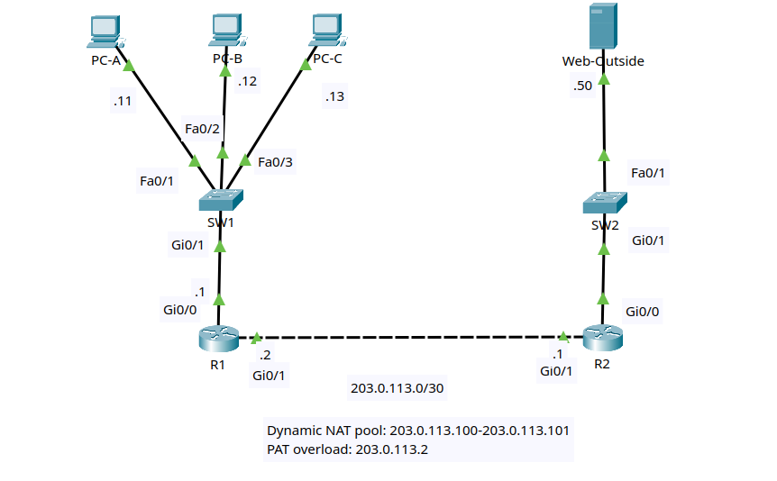

# Lab 2: Dynamic NAT and PAT

## Goal

Build a small inside/outside network and configure two dynamic IPv4 NAT
behaviors on the edge router:

- Dynamic NAT using a public address pool for selected inside hosts.
- PAT overload using the outside interface address for another inside host.

You will identify NAT inside and outside interfaces, create standard ACLs for
different translation policies, configure a NAT pool, verify dynamic
translations, clear temporary entries, and troubleshoot route requirements for
inside global addresses.

This lab stays within CCNA-level NAT topics. It focuses on dynamic NAT and PAT
overload. It does not use NAT Virtual Interface, policy NAT, or twice NAT.

## Lab files

- Packet Tracer activity: build and save as
  `packet-tracer/lab-02-dynamic-nat-and-pat.pkt`
- Topology image: [images/topology.png](images/topology.png)

## Topology



Use two Cisco 2911 routers, two Cisco 2960 switches, three PCs, and one
server. `Web-Outside` is a Packet Tracer server device.

```text
                 Inside network                    Outside network
                 192.168.20.0/24                   198.51.100.0/24

          PC-A        PC-B        PC-C                 Web-Outside
           |           |           |                         |
         Fa0/1       Fa0/2       Fa0/3                     Fa0/1
           \           |          /                          |
                    SW1                                  SW2
                    Gi0/1                                Gi0/1
                      |                                    |
                    Gi0/0                                Gi0/0
                      R1 Gi0/1 ---------------- Gi0/1 R2
                       203.0.113.2     link      203.0.113.1
                              203.0.113.0/30

                 Dynamic NAT pool: 203.0.113.100-203.0.113.101
                 PAT overload:     203.0.113.2
```

R1 is the NAT edge router. R2 represents the ISP or outside router.

### Cabling table

| Device | Port | Connects to | Port |
|---|---|---|---|
| R1 | Gi0/0 | SW1 | Gi0/1 |
| R1 | Gi0/1 | R2 | Gi0/1 |
| R2 | Gi0/0 | SW2 | Gi0/1 |
| PC-A | FastEthernet0 | SW1 | Fa0/1 |
| PC-B | FastEthernet0 | SW1 | Fa0/2 |
| PC-C | FastEthernet0 | SW1 | Fa0/3 |
| Web-Outside | FastEthernet0 | SW2 | Fa0/1 |

Packet Tracer's **Automatically Choose Connection Type** option is suitable
for every link. If your router model uses interface names such as `Gi0/0/0`,
substitute its names consistently throughout the lab.

## Addressing plan

| Device | Interface | IP address | Mask | Default gateway |
|---|---|---|---|---|
| R1 | Gi0/0 | 192.168.20.1 | 255.255.255.0 | N/A |
| R1 | Gi0/1 | 203.0.113.2 | 255.255.255.252 | N/A |
| R2 | Gi0/0 | 198.51.100.1 | 255.255.255.0 | N/A |
| R2 | Gi0/1 | 203.0.113.1 | 255.255.255.252 | N/A |
| PC-A | FastEthernet0 | 192.168.20.11 | 255.255.255.0 | 192.168.20.1 |
| PC-B | FastEthernet0 | 192.168.20.12 | 255.255.255.0 | 192.168.20.1 |
| PC-C | FastEthernet0 | 192.168.20.13 | 255.255.255.0 | 192.168.20.1 |
| Web-Outside | FastEthernet0 | 198.51.100.50 | 255.255.255.0 | 198.51.100.1 |

## NAT plan

| Purpose | Inside local | Inside global | Method |
|---|---|---|---|
| PC-A dynamic translation | `192.168.20.11` | Pool address | Dynamic NAT |
| PC-B dynamic translation | `192.168.20.12` | Pool address | Dynamic NAT |
| PC-C user traffic | `192.168.20.13` | `203.0.113.2` | PAT overload on R1 Gi0/1 |

R2 needs a route to `203.0.113.96/29` through R1 because the dynamic NAT pool
is not part of the directly connected `203.0.113.0/30` transit link.

## Routing plan

| Router | Destination | Prefix | Next hop |
|---|---|---|---|
| R1 | Default route | `0.0.0.0/0` | `203.0.113.1` |
| R2 | Dynamic NAT pool | `203.0.113.96/29` | `203.0.113.2` |

Do not configure a route on R2 to `192.168.20.0/24`. The outside network
should use translated addresses, not private inside-local addresses.

## Lab tasks

Try each task from the requirements first. Use the commands below as a
reference if you get stuck.

### Task 1 - Build and name the devices

1. Add two 2911 routers, two 2960 switches, three PCs, and one server.
2. Cable the devices according to the cabling table.
3. Rename the devices `R1`, `R2`, `SW1`, `SW2`, `PC-A`, `PC-B`, `PC-C`, and
   `Web-Outside`.
4. Save the project as `lab-02-dynamic-nat-and-pat.pkt`.

On each router and switch, substitute the correct hostname:

```ios
enable
configure terminal
hostname R1
no ip domain-lookup
end
```

### Task 2 - Configure IP addressing

Configure each PC and server through **Desktop > IP Configuration**.

On the server, also confirm the HTTP service is enabled under
**Services > HTTP**.

Configure R1:

```ios
configure terminal
interface gi0/0
 description INSIDE_LAN
 ip address 192.168.20.1 255.255.255.0
 no shutdown
interface gi0/1
 description OUTSIDE_TO_R2
 ip address 203.0.113.2 255.255.255.252
 no shutdown
end
```

Configure R2:

```ios
configure terminal
interface gi0/0
 description OUTSIDE_SERVER_LAN
 ip address 198.51.100.1 255.255.255.0
 no shutdown
interface gi0/1
 description TO_R1
 ip address 203.0.113.1 255.255.255.252
 no shutdown
end
```

Verify:

```ios
show ip interface brief
show interfaces description
```

### Task 3 - Configure baseline routing

On R1, configure a default route toward the outside network:

```ios
configure terminal
ip route 0.0.0.0 0.0.0.0 203.0.113.1
end
```

Before NAT is configured, test the topology:

```text
PC-A> ping 192.168.20.1
PC-A> ping 203.0.113.2
PC-A> ping 203.0.113.1
PC-A> ping 198.51.100.50
```

Expected result:

| Test | Expected |
|---|---|
| PC-A to R1 inside interface | Succeeds |
| PC-A to R1 outside interface | Succeeds |
| PC-A to R2 transit interface | Fails |
| PC-A to Web-Outside | Fails |

The tests beyond R1 fail because outside devices receive traffic sourced from
`192.168.20.11`, but R2 has no route back to the private inside LAN.

### Task 4 - Mark NAT inside and outside interfaces

On R1:

```ios
configure terminal
interface gi0/0
 ip nat inside
interface gi0/1
 ip nat outside
end
```

Verify:

```ios
show ip nat statistics
show running-config interface gi0/0
show running-config interface gi0/1
```

### Task 5 - Configure dynamic NAT with a pool

On R1, create a standard ACL for PC-A and PC-B, define the public pool, and
bind the ACL to the pool:

```ios
configure terminal
access-list 10 permit host 192.168.20.11
access-list 10 permit host 192.168.20.12
ip nat pool DYNAMIC_POOL 203.0.113.100 203.0.113.101 netmask 255.255.255.248
ip nat inside source list 10 pool DYNAMIC_POOL
end
```

On R2, add a route back to the dynamic NAT pool:

```ios
configure terminal
ip route 203.0.113.96 255.255.255.248 203.0.113.2
end
```

Generate traffic from PC-A and PC-B:

```text
PC-A> ping 198.51.100.50
PC-B> ping 198.51.100.50
```

Both pings should now succeed.

On R1, verify dynamic translations:

```ios
show ip nat translations
show ip nat statistics
show access-lists 10
```

You should see `192.168.20.11` and `192.168.20.12` translated to pool
addresses `203.0.113.100` and `203.0.113.101`.

### Task 6 - Configure PAT overload for PC-C

On R1, match PC-C with a separate standard ACL, then overload traffic on the
outside interface address:

```ios
configure terminal
access-list 20 permit host 192.168.20.13
ip nat inside source list 20 interface gi0/1 overload
end
```

Generate traffic from PC-C:

```text
PC-C> ping 198.51.100.50
```

The ping should succeed.

On R1, compare dynamic NAT and PAT entries:

```ios
show ip nat translations
show ip nat statistics
show access-lists 20
```

Expected observations:

| Inside host | Expected translation |
|---|---|
| PC-A | One dynamic pool address |
| PC-B | One dynamic pool address |
| PC-C | R1 outside interface address with protocol identifiers |

Dynamic NAT creates temporary one-to-one mappings. PAT overload lets PC-C share
`203.0.113.2` by tracking transport information.

### Task 7 - Verify HTTP access through NAT

From each inside PC, open **Desktop > Web Browser** and browse to:

```text
http://198.51.100.50
```

Each host should reach the HTTP service on Web-Outside.

On R1, inspect the translation table again:

```ios
show ip nat translations
show ip nat translations verbose
```

You should see additional protocol-specific entries created by the web
traffic.

### Task 8 - Clear and recreate dynamic translations

On R1:

```ios
clear ip nat translation *
show ip nat translations
```

Generate new traffic:

```text
PC-A> ping 198.51.100.50
PC-C> ping 198.51.100.50
```

Then check the table again:

```ios
show ip nat translations
```

Dynamic NAT and PAT entries reappear only after new traffic crosses from the
inside interface to the outside interface.

### Task 9 - Save the configuration

On R1 and R2:

```ios
copy running-config startup-config
```

Save the Packet Tracer activity file.

## Troubleshooting checklist

Use this checklist if dynamic NAT or PAT does not work:

| Symptom | Check |
|---|---|
| PC-A or PC-B cannot reach Web-Outside | R1 default route, NAT inside/outside interfaces, ACL 10, NAT pool, and R2 route to `203.0.113.96/29` |
| PC-C cannot reach Web-Outside | ACL 20 and PAT overload command using R1 Gi0/1 |
| NAT table is empty | Generate traffic that crosses from an inside interface to an outside interface |
| ACL counters do not increase | Confirm the ACL matches the correct inside local host addresses |
| Dynamic pool hosts translate but replies fail | Confirm R2 has a route to the pool through `203.0.113.2` |
| PC-C uses a pool address | Confirm PC-C is not permitted by ACL 10 |

## Reflection questions

1. Why does dynamic NAT need a pool, but PAT can use the R1 outside interface?
2. Why does R2 need a route to `203.0.113.96/29`?
3. What is different in the translation table for PC-A compared with PC-C?
4. What happens to the translation table after `clear ip nat translation *`?
5. Why should R2 not have a route to `192.168.20.0/24` in this lab?

## Challenge

Change ACL 10 so PC-C also tries to use dynamic NAT, then remove the PAT rule
for ACL 20. With only two pool addresses available, generate traffic from all
three inside PCs and observe what happens when the dynamic pool is exhausted.

Restore the original design before saving your final lab file:

```ios
configure terminal
no ip nat inside source list 10 pool DYNAMIC_POOL
no ip nat inside source list 20 interface gi0/1 overload
no access-list 10
no access-list 20
access-list 10 permit host 192.168.20.11
access-list 10 permit host 192.168.20.12
access-list 20 permit host 192.168.20.13
ip nat inside source list 10 pool DYNAMIC_POOL
ip nat inside source list 20 interface gi0/1 overload
end
```
